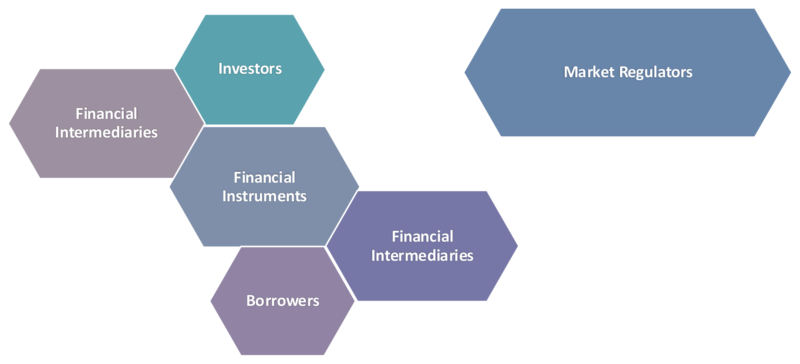

```{r setup, include=FALSE}
library(knitr)
library(kableExtra)
library(tidyverse)
library(huxtable)

# don't show code unless we explicitly set echo = TRUE
opts_chunk$set(echo = TRUE, message=FALSE, fig.align="center", fig.pos = "H")
opts <- options(knitr.kable.NA = "")

## control long outputs by using eg `max.lines = 10`
hook_output_default <- knitr::knit_hooks$get('output')
truncate_to_lines <- function(x, n) {
   if (!is.null(n)) {
      x = unlist(stringr::str_split(x, '\n'))
      if (length(x) > n) {
         # truncate the output
         x = c(head(x, n), '...\n')
      }
      x = paste(x, collapse = '\n') # paste first n lines together
   }
   x
}
knitr::knit_hooks$set(output = function(x, options) {
   max.lines <- options$max.lines
   x <- truncate_to_lines(x, max.lines)
   hook_output_default(x, options)
})
```

```{r xaringanExtra-extension, echo=FALSE}
# add search box
xaringanExtra::use_search(show_icon = TRUE, position = "bottom-left")
# enable tile view
xaringanExtra::use_tile_view()
```


class: inverse, center, middle

# Learning Outcomes

---

class: center-v

- Understand the role of the financial market and its participants

- Differentiate between real and financial assets

- Identify the financial markets in which the different financial instruments are traded

- Understand how assets are traded in the financial market

---
class: inverse, center, middle
# The Financial Market
---

## The Financial Market



???
- Investors and Borrowers are the core reason financial markets exist.

- The investment process is one side of a bilateral highway: while investors send money into the future, borrowers bring future money into the present.

- Note that an asset to party A is always a liability to counterparty B.

- Financial intermediaries facilitate trading in the financial market:
  - Connect buyers to sellers, e.g., brokers, exchange infrastructure
  - Act as middlemen in financial trades, e.g., dealers
  - Create financial instruments, e.g., securitizers, deposit institutions
  - Provide support services, e.g., financial analysts, credit rating agencies, investment banks etc.

- Financial market regulators have an oversight function over financial markets. Their goal is to ensure financial markets are fair, transparent, orderly and safe.

---

## Role of the Financial Market

- Facilitates the **investment process**

- Ensures **efficient capital allocation** through the dissemination of accurate information

- Enables economic entities to **time their consumption**

- Facilitates **risk management** through the reallocation of risk based on risk appetite

- Facilitates the stability and longevity of business organizations through the **separation of ownership and management**

???
- Financial markets are a platform for the surplus and deficit side of the economy to meet.

- The financial market (through the dispersion of accurate information) allows investors to prioritize securities (and consequently the real assets) that have the highest expected value added.

- The financial market enables economic entities to postpone or fast-forward consumption:
  - Through the purchase of securities, the surplus side of the economy can send money to the future.
  - Through the sale of securities, the deficit side of the economy can bring future money to the present.

- The financial market also allows for risk transfer from the more risk-averse to the risk-tolerant investor. The financial market compensates the more risk-averse investor with lower risk and compensates the risk-tolerant investor with higher returns.

- Financial markets do not always function as they should:
  - Financial bubbles that arise due to inefficient market prices, e.g., Asian Financial Crisis of 1996-7, Global Financial Crisis of 2007-8, Bitcoin?
  - Lack of accurate information / information asymmetry, e.g., insider trading, the Enron-Andersen scandal
  - Liquidity crises due to limits to trades, e.g., scholars argue that banning short trading inhibits market liquidity

---
class: inverse, center, middle
# Financial Assets
---

## Real and Financial Assets

**Real Assets**

- represent the productive units in the economy
- have intrinsic value
- are less liquid than financial assets
  - *E.g., intellectual property, factories, land, buildings, raw materials*

**Financial Assets**

- represent contractual claims to real assets
  - *E.g., equity shares represent a claim to the assets (and profits) of a company*
- always have a corresponding liability
  - *E.g., a Treasury bond is an asset to you but a liability to the issuing government*
- derive their value from the contractual obligation of the counterparty

???
Discussion question: Is cash a real or financial asset? Explain.

---

## Financial Assets

Three broad classes of financial assets:

- **Fixed-income securities** represent a claim to a **fixed** and **predetermined** stream of income
  - *E.g., Treasury bills, corporate bonds*

- **Equity securities** represent a stake in the residual value (net assets) of a company
  - *E.g., ordinary shares, preference shares*

- **Derivative securities** derive their value from the value of an underlying financial asset
  - *E.g., futures, options*

---

## Fixed-Income Instruments I

**Sovereign fixed-income instruments:**

- Issued by sovereign governments
- Sovereign short-term bills have short maturity, *e.g., Treasury bills*
- Sovereign bonds have longer maturity, *e.g., Treasury bonds*

**Corporate fixed-income instruments:**

- Issued by corporate entities
- Short-term instruments, *e.g., commercial papers*
- Long-term instruments, *e.g., corporate bonds*

???
- Some developed countries issue inflation-indexed sovereign bonds. These bonds protect the holder from inflation by adjusting the principal and/or interest payments for inflation.

- Commercial papers are unsecured short-term debt notes.

- In spite of being unsecured, commercial papers are not as risky, as they are often issued with very short maturity, e.g., one month.

- Interest payments on fixed-income liabilities are generally tax exempt.

- Interest income on some sovereign/municipal bonds is tax exempt.

---

## Fixed-Income Instruments II

**Certificate of Deposit / Fixed deposit**

- Time-fixed deposit held with a deposit institution, *e.g., banks*
- Pays interest and capital only at maturity

**Asset-Backed Security:**

- Is a pool of fixed-income assets, *e.g., mortgage loans*
- Cashflow is derived from the pool of assets
- Issued through a Special Purpose Entity (SPE)

???
- Fixed deposits cannot be withdrawn before maturity.

- An asset-backed security is a fixed-income security whose cashflows are based on a pool of fixed-income assets held by a special purpose entity, e.g., mortgage-backed assets. The mortgage payments from the pool of mortgage loans are distributed to the investors who have purchased the mortgage-backed security.

- Interest payments on fixed-income liabilities are generally tax exempt.

- Interest income on some sovereign/municipal bonds is tax exempt.

---

## Equity Instruments

**Preference share certificate:**

- Promises fixed dividend payments to the holder of the certificate
- Accumulates any dividend not paid to the preference shareholder in any period
- When a dividend is declared, preference shareholders have the right to all accumulated dividend payments before ordinary shareholders
- Preference shareholders **do not** have voting rights

**Ordinary share certificate:**

- Conveys voting rights to the holder
- The holder is not guaranteed dividends unless dividends are declared
- Ordinary shareholders are the most vulnerable to the agency issue

???
- However, the dividends to preference shareholders are not a contractual obligation until declared. It is up to management discretion whether a dividend is declared, or profit is reinvested.

- Ordinary shares:
  - Even after a dividend is declared, ordinary shareholders are last in line to receive dividends, after preference shareholders.
  - They appoint the board of directors, who in turn appoint managers to run the business.
  - They own the retained earnings (net income less dividend payments) of the company.
  - However, they are the "last in line" to receive repayment in case a company goes bankrupt.

---

## Derivative Contracts I

**Forward/Futures contract:**

- is a *binding* agreement to deliver a financial asset for a predetermined price at the maturity of the contract
- **Forward contracts** are *customized* contracts that trade over-the-counter
- **Futures contracts** are *standardized* and exchange-traded contracts

**Swap contracts:**

- an agreement to exchange periodic cashflows based on a notional amount

???
- The underlying asset may be a financial asset (e.g., interest rate swaps, share options) or a real asset (e.g., commodity futures).

- Forwards are vulnerable to counterparty risk.

- Futures contracts do not have any counterparty risk:
  - Because they are standardized they can be traded at any time before maturity on the exchange.
  - The clearing house guarantees the settlement of the futures contract by acting as the counterparty to the transaction in case any of the parties defaults.
  - The clearing house guarantees this settlement by requiring that both parties maintain a special margin account until the maturity date.

- With futures/forward contracts:
  - the party promising to buy the asset takes the **long position**
  - the party promising to deliver the asset takes the **short position**

- Swap contracts are an agreement to exchange periodic cashflows based on a notional amount, where cashflow A is a fixed amount and cashflow B is a variable amount. E.g., exchanging interest rate payments on a loan with a fixed interest rate for interest payments on a loan with a variable interest rate.

---

## Derivative Contracts II

**Option contracts:**

- **Call options** give the holder the right *without any obligation* to ***buy*** the underlying asset at the exercise price.

- **Put options** give the holder the right *without any obligation* to **sell** the underlying asset at the exercise price.

- **European options** are only exercisable at maturity.

- **American options** can be exercised at any time before maturity.

???
- Determining the long vs short position is a little trickier with option contracts.

- Whoever buys the option contract (put or call) has taken a long position. Whoever sells/writes the option contract (put or call) has taken a short position.

---
class: inverse, center, middle
# Financial Market Participants
---

## Financial Market Intermediaries I

**Brokers:**

- Facilitate trading by connecting buyers and sellers
- Execute trades on behalf of their clients

**Dealers:**

- Facilitate trades by trading with clients
- Move liquidity across time

**Securitizers:**

- Create new financial instruments
  - *E.g., Special Purpose Entities*

---

## Financial Market Intermediaries II

**Investment Banks:**

- Advise firms on financing issues such as IPOs, corporate bond issues, mergers and acquisitions
- Act as underwriters during IPOs

**Credit Rating Agencies:**

- Rate the creditworthiness of bonds based on the likelihood of default

**Financial Analysts:**

- Analyse financial data and generate market information
- Help determine the value of financial instruments

???
- Financial intermediaries are agents that facilitate the functioning of the financial system.

- Electronic exchanges also function as brokers. This is because, when traders submit their orders online, the electronic trading system can help match orders.

- Other intermediaries include arbitrageurs, investment firms, mutual funds, credit rating agencies, securitizers etc.

---

## Financial Market Intermediaries III

**Clearing houses:**

- Arrange final settlement of trades
- Guarantee futures contracts against counterparty risk

**Exchanges:**

- Platform for physical or electronic trading
- Public exchanges are either self-regulating or overseen by a government agency
  - *E.g., Oslo Børs, New York Stock Exchange*
- Private exchanges function as brokers and are not as strictly regulated
  - *E.g., Alternative Trading Systems or dark pools*

???
- Counterparty risk is the risk that the other party in a financial transaction will fail to meet their obligations, either by defaulting on a payment or by not delivering an asset as agreed.

- Clearing houses act as intermediaries between buyers and sellers in futures and other derivative markets. They guarantee the performance of both sides of the contract, effectively eliminating counterparty risk. They do this by:
  - Becoming the central counterparty to every trade (the buyer to every seller and the seller to every buyer),
  - Requiring margin deposits from participants, and
  - Conducting daily marking-to-market to manage potential losses.

- Electronic exchanges also function as brokers. This is because, when traders submit their orders online, the electronic trading system can help match orders.

---

## Market Regulators

**Government Regulatory Agencies:**

- Ensure financial markets are fair and orderly by either

  - overseeing operations and transactions within the exchange

  **OR**

  - empowering public exchanges with regulatory authority over their members

- *E.g., Securities and Exchange Commission, The Financial Supervisory Authority of Norway (Finanstilsynet)*

???
- Regulators sit above the intermediaries: they do not trade, they set and enforce the rules of the game.

- Other intermediaries include arbitrageurs, investment firms, mutual funds, credit rating agencies, securitizers etc.

---
class: inverse, center, middle
# Financial Market Organization
---

## Primary Capital Market

The market for **newly issued** securities of a company.

- **Initial Public Offering (IPO)** is the first issue of shares by a public company

- **Seasoned equity offering (SEO)** is the additional issue of shares by a public company

- **Shelf registration**: a form of SEO where a public company slowly sells shares that were already registered

- **Private placement** is the sale of the shares of privately owned companies to individuals or venture capitalist firms

???
- Note that primary capital markets are examples of brokered markets.

- Shelf registrations are usually allowed for a restricted period to ensure that the information provided at the initial registration is still valid.

---

## Secondary Financial Markets

**The Secondary Capital Market:**

- The market for subsequent trading of a previously issued security
- Secondary markets may be organized as dealer markets or auction markets (i.e., stock exchanges)

**The Money Market:**

- The market for trading short-term fixed-income instruments, *e.g., Treasury bills*
- The money market is organized as a dealer / over-the-counter market

---

## Financial Market Structures

**Broker-driven Markets:**

- Rely on brokers to assemble the market or organize trading
- Ideal for assets of a unique nature, *e.g., the real estate market*

**Dealer-driven Markets:**

- Trading primarily occurs through dealers, *e.g., the bond market*

**Auction / Open outcry Markets:**

- Traders meet to trade with each other, or delegate their brokers to trade on their behalf through trading instructions, *e.g., stock exchanges*

???
Most auction markets are now electronic markets.

---
class: example-block

## Identifying Market Structures


Which type of market are the following assets predominantly traded in?

<ol type="a">
<li>Used cars</li>
<li>Artworks</li>
<li>Rare coins</li>
</ol>

???
Rule of thumb: assets that are infrequently sold or are unique in nature are often traded in broker-driven markets.

---
class: inverse, center, middle
# Trading in the Financial Market
---

## Trading Strategies

**Hedgers:**

- Trade for risk management purposes
- Rely on available liquidity within the financial market

**Information-driven / Speculative traders:**

- Trade to capitalize on superior information about the market
- Provide liquidity to the financial market

**Arbitrage traders:**

- Trade to capitalize on price differentials across markets or instruments
- Provide liquidity to the financial market

???
This is a classification of traders based on their trading strategy/motives.

---

## Long Trade Position

A **position** in an asset

- is the quantity of a financial instrument that an entity owns or owes.

**A long trade:**

- Involves the purchase or ownership of the investment instrument
- Gains from price appreciation
- Has unlimited gain possibilities and limited possibility for losses

???
- If I buy shares in company A, I am betting that its price increases.

- I have unlimited gain possibilities, as the value of shares in A can increase infinitely.

- In contrast, I have limited loss possibilities, as my loss stops once the value of the shares hits zero.

---

## Short Trade Positions

**A short trade:**

- Involves selling a previously owned or borrowed investment instrument

- Gains from price depreciation
  - *i.e., betting against the market*

- Has limited gain possibilities and unlimited loss possibilities

- Is a high-risk position and is banned in some exchanges

???
- If I short shares in company A, I am betting that its price falls.

- I have limited gain possibilities, as I can only gain until the price of shares in A hits zero.

- In contrast, my losses are unlimited, as the shares can increase infinitely.

- If the asset is borrowed from a broker, the short trader has to pay the broker all dividends and interest income that accrue while the trade position is open. In addition, the broker will charge a fee for lending the security to the short trader.

- Due to the risk associated with it, short trading is banned in some exchanges.

- E.g., short selling with borrowed shares. If I am betting that the price of shares in company A falls in 3 months from 10 kr to 5 kr:
  - I can borrow shares from a broker-dealer, to be returned in 3 months.
  - I then sell the borrowed shares today at the current price of 10 kr.
  - If I am correct, I can buy back the same shares at the current value of 5 kr to return to the broker I borrowed them from, and make a gain (= 10 − 5 − any dividends the share paid during the 3 months I held them − transaction costs − fees to the broker for locating and loaning me the shares).

---

## Trading on Margin

**A margin trade** involves borrowing funds to finance a long position in an investment security.

**The margin loan** is the amount borrowed from a broker to leverage a position.

The **call money rate** is the interest charged by the broker on the margin loan.

The **leverage ratio** indicates how much riskier a leveraged position is relative to an unleveraged position.

$$\text{Leverage Ratio} = \frac{\text{Value of a position}}{\text{Value of the equity investment in the position}}$$

???
- Trading on margin is also called leveraging a trade position.

- Margin trades require a margin account be held with the broker.

- For example, a position with a leverage ratio of 2.5:
  - gains 25% for every 10% price increase, and
  - loses 25% for every 10% price decrease.

---

## The Margin Account

- A **margin account** is a trading account held with a broker for trade positions involving margin trades, short trades, and futures contracts.

- Margin accounts are subject to different reserve requirements while the trade position remains open:
  - **Initial margin**: minimum equity required at the beginning of the trade
  - **Maintenance margin**: minimum equity required while the trade position is open
  - **Margin calls**: request from the broker to refill the margin account if the balance falls below the maintenance margin requirement

???
- Long trades can be conducted through a cash brokerage account if the trade is financed solely with the trader's funds. However, margin and short trades must be conducted through a margin account.

- Futures margin is the amount deposited with the broker when a trader enters a futures position.

- The margin requirement depends on the trade and is set by the broker (except for futures transactions, where the clearing house sets the requirements):
  - For margin trades: the initial margin is usually 50% of the security's value, while maintenance is at 25% of the value.
  - For short trades: the proceeds from selling the security are kept in the margin account, in addition to a maintenance margin of 25%.
  - Futures contracts normally have smaller margin requirements, usually 3–12% of the contract's notional value.

---

## Types of Trade Orders

- A **market order** instructs the broker to obtain the best price immediately available when filling the order.

- A **limit order** instructs the broker to obtain the best price, but imposes a ceiling (on purchase orders) or floor (on sale orders).

- A **marketable limit order** sets a more aggressive limit, e.g., a ceiling (floor) limit that is higher (lower) than or close to the market price.

- A **stop-sell order** instructs the broker to sell if the price of the security falls below a specific limit.

- A **stop-buy order** instructs the broker to buy if the price of the security rises above a specific limit.

???
- Often individuals trade in the financial market through a broker.

- They give instructions through trade orders to their broker, which contain information about the trade such as:
  - The target instrument
  - Instructions to buy/sell the instrument
  - How to fill the order (execution instructions), i.e., market order
  - When to fill the order (validity instructions)
  - How to arrange final settlement (clearing instructions)

- Short trades will often have standing stop-buy orders to minimize their loss.

---
class: inverse, center, middle

# The End
