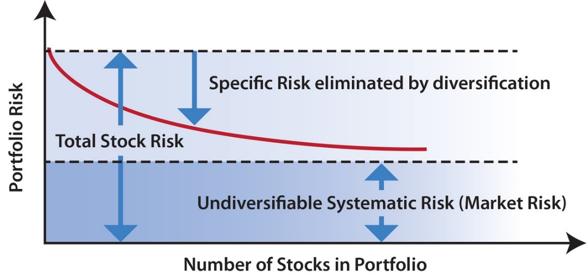
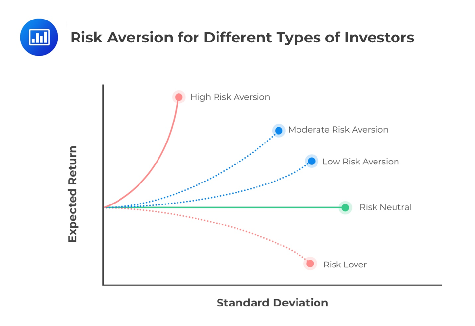
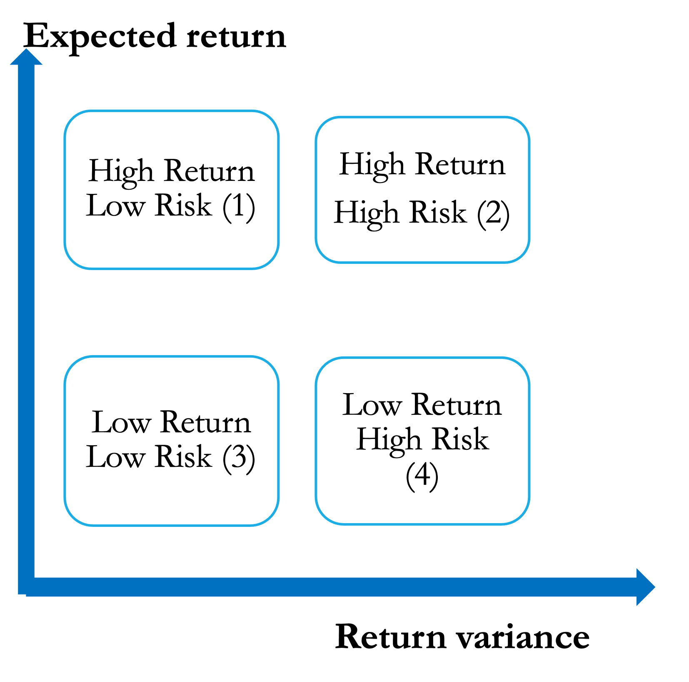
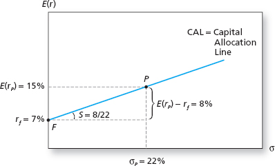
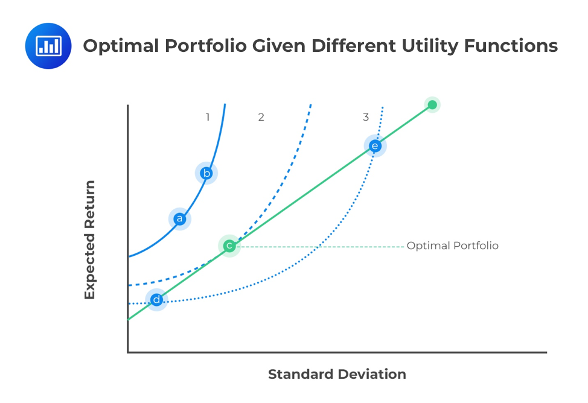
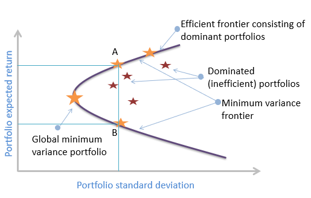
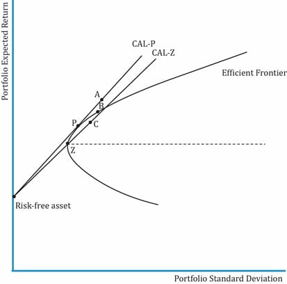
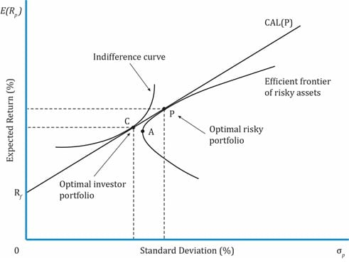

```{r child = "_setup.Rmd"}
```


class: inverse, center, middle

# Agenda

---

class: center-v

- Computing Investment Risk and Return
  - Expected return, variance and standard deviation
  - Holding period, arithmetic and geometric returns
  - Historical risk and covariance

- Constructing an Investment Portfolio
  - Diversification and Modern Portfolio Theory
  - Risk tolerance and the indifference curve
  - The complete portfolio and the Capital Allocation Line

---
class: inverse, center, middle
# Computing Investment Risk and Return
---

## Estimating Risk and Return

We cannot know the actual return on an investment in the future. A more realistic approach is to estimate the expected return conditional on a set of possible **investment scenarios**. 

.pull-layout-v.split-60-40[

.pull-left[
- Expected return on asset $i$:
  $$E(r_i) = \sum_{s=1}^{N} r_s \cdot p_s$$

- Variance of expected return $(\var(r_i) = \sigma_i^2)$:
  $$\begin{aligned}
  \sigma_i^2 
  &= \E\left(r - E(r_i)\right)^2 \\
  &= \sum_{s=1}^{N} \left[ r_s - E(r_i) \right]^2 \cdot p_s
  \end{aligned}$$

- Standard deviation of expected return $(\sigma_i)$:
  $$\sigma_i = \sqrt{\sigma_i^2}$$
]

.pull-right[

.center-v[

.small-text[
Where:
- $r_s$ = return in investment scenario $s$;
- $p_s$ = probability of scenario $s$ occurring;
- $N$ = number of forecasted investment scenarios, with $\sum_{s=1}^{N} p_s = 1$.
]

]

]

]

???
- We do not know what our investment would yield a year from now. Using probability, you can approximate the return from your investment some time into the future.

- The uncertainty about what the actual return will be, and its deviation from what is expected, is an investment risk. We measure this risk using the standard deviation and variance of the expected returns.

---
class: example-block

## Expected Returns

| | Bear Market | Normal Market | Bull Market |
| ---- | ---- | ---- | ---- |
| **Probability** | 0.2 | 0.5 | 0.3 |
| **Asset X** | -20% | 18% | 50% |
| **Asset Y** | -15% | 20% | 10% |

- What are the expected rates of return for Stocks X and Y?

???
Answers: Asset X = 0.2, Asset Y = 0.1

---
class: example-block

## Standard Deviation of Returns

| | Bear Market | Normal Market | Bull Market |
| ---- | ---- | ---- | ---- |
| **Probability** | 0.2 | 0.5 | 0.3 |
| **Asset X** | -20% | 18% | 50% |
| **Asset Y** | -15% | 20% | 10% |

- What are the standard deviations of returns on Stock X and Y?

???
Answers (standard deviations): Asset X = 0.24, Asset Y = 0.13

---

## Holding Period Return

**Holding Period Return (HPR):**

- Return on an investment based on all income and price changes during a holding period.
  - If the income is received at the beginning of the holding period, the HPR must include the cash flow derived from reinvesting the income.

$$HPR_1 = \frac{P_1 - P_0 + I_1}{P_0} = \frac{P_1 + I_1}{P_0} - 1$$


Where: 
- $P_1$ = price at the end of the period; 
- $P_0$ = price at the beginning of the period; 
- $I_1$ = income (dividend or interest) earned during the holding period.


---
class: example-block

## Holding Period Return on a Bond

A 30-year US treasury bond with an 8% coupon is currently selling at par. The coupon on this bond is paid annually. The probability distribution of the price of the bond a year from now is given as:

.compact-table[
| State of the Economy | Probability | Bond Price |
| -------------------- | ----------- | ---------- |
| Boom | 0.20 | 111 |
| Normal growth | 0.50 | 108 |
| Recession | 0.30 | 107 |
]

- Compute the probability distribution of the 1-year HPR on this bond.
- What is the expected HPR on this bond?

???
Compute the HPR based on the bond price in each future state.

Answers: 0.19, 0.16, 0.15

$E[HPR]=0.20\times 0.19 + 0.5\times 0.16 0.3\times 0.15 =0.163$

---

## Average Return

Given a series of portfolio returns $r_{p,t}$, $t=1,2,\ldots,T$, the average return can be calculated in two ways:

- **Arithmetic mean** (AM) portfolio return
  $$\begin{aligned}
  \text{Arithmetic } \bar{r}_{p, 0:T} &= \frac{1}{T}\sum_{t=1}^T r_{p,t} \\
  &= \frac{1}{T} \left(r_{p,1} + r_{p,2} + \cdots + r_{p,T}\right)
  \end{aligned}$$

- **Geometric mean** (GM) portfolio return
  $$\begin{aligned}
  \text{Geometric } \bar{r}_{p, 0:T} &= \left[\prod_{t=1}^T (1+r_{p,t}) \right] ^{\frac{1}{T}}-1 \\
  &= \sqrt[T]{(1 + r_{p,1}) \times (1 + r_{p,2}) \times \cdots \times (1 + r_{p,T})} - 1
  \end{aligned}$$

???

- GM the preferred method when computing the average rate of return over several holding periods
- GM is the same as the arithmetic average if there is no variance in return
- When there is variation, the geometric average is always smaller than the arithmetic average.
- GM offers the best estimate of past returns

---
class: example-block

## Arithmetic Mean Return

| | Year 1 | Year 2 | Year 3 | Year 4 | Year 5 |
| ---- | ---- | ---- | ---- | ---- | ---- |
| **Fund Y (%)** | 19.5 | -1.9 | 19.7 | 35.0 | 5.7 |

- What is the arithmetic mean return on Fund Y?
- What is the geometric mean return on Fund Y?

???
Answer 
- arithmetic mean: 0.156
- geometric mean: 0.1490

Note that the geometric mean (0.1490) is smaller than the arithmetic mean (0.156), because the returns vary across periods.

---
class: example-block
## Geometric Mean Better Captures Investment Performance

Sarah invests $100 in a fund for two months. In the **first month**, her investment grows by 10%, but in the **second month**, it loses 10%.

.lower-alpha[ 
1. What is the arithmetic average return? What does it suggest about the change in her $100 investment?
2. What is the actual value of her investment after two months?
3. What is the geometric return?
4. Why does the geometric return provide a better measure of Sarah’s investment performance compared to the arithmetic average?
]
???

answer:

(a) $AM = (r_1 + r_2) /2 = (10\% - 10\%)/2 = 0\%$. This suggests that her investment has not changed in value.

(b) After the first month, her investment grows to $100 \* (1 + 0.10) = $110. After the second month, it decreases to $110 \* (1 - 0.10) = $99.

(c) $GM = [(1+r_1)(1+r_2)]^{1/2} - 1 = [(1 + 0.10) * (1 - 0.10)]^{1/2} - 1 ≈ -0.50\%$

(d) The geometric return provides a better measure of Sarah’s investment performance because it accounts for the **compounding effect of returns over multiple periods**. Unlike the arithmetic average, which can be misleading in volatile markets, the geometric return reflects the actual growth rate of the investment, showing that Sarah's investment decreased in value over the two months.

---

.tight-top.tight-bottom[
## Historical Risk
]

.tight-top.tight-math[
- Variance of return $(\sigma^2)$:
  $$\begin{aligned}
  \text{Unbiased estimator:} \quad \sigma^2 &= \frac{1}{T-1} \sum_{t=1}^{T} \left[ r_t - \bar{r} \right]^2 \\
  \text{Biased estimator:} \quad s^2 &= \frac{1}{T}\sum_{t=1}^{T}\left[ r_t - \bar{r}\right]^2
  \end{aligned}$$
  In practice, both version are used.
  When $T$ is large, the difference between $T$ and $T-1$ becomes negligible. 
]

.tight-math[
- Standard deviation of return $(\sigma)$:
  $$\sigma = \sqrt{\sigma^2}$$

- Covariance between two assets $(\sigma_{1,2})$:
  $$\sigma_{1,2} = \frac{1}{T-1} \sum_{t=1}^{T} \left[ (r_{1,t} - \bar{r}_1) \cdot (r_{2,t} - \bar{r}_2) \right]$$
]

Where: $r_t$ = return in each period; $\bar{r}$ = average return; $T$ = number of periods.

???
A refresher on computing risk and covariance.

---
class: inverse, center, middle
# Constructing an Investment Portfolio
---

## Portfolio Diversification

> "*Do not put all your eggs in one basket*"

**Diversification** is a portfolio allocation strategy that minimizes specific risk by holding assets that are less than perfectly correlated with each other.

The combination of assets depends on the specific risk the investor wishes to minimize:

- **Geographical risk** is minimized by holding assets from different countries
- **Sector-specific risk** is minimized by holding stocks from different sectors/industries
- **Default risk** is minimized by including sovereign bonds
- **Liquidity risk** can be minimized by including cash and cash equivalents

???
- We begin with the assumption that investors are rational, and that the average investor's investment objective is to maximize their investment return at a given level of risk (or minimize risk at a given level of return).

- As we will see later, there is always a risk-return tradeoff with any legitimate investment.

- An investment portfolio is a bundle of different financial or real assets held by an investor at any point in time. By investing in a variety of financial assets, a rational investor can maximize return at a given level of risk.

---

## Modern Portfolio Theory

The **Modern Portfolio Theory** (MPT), developed by Harry Markowitz (1952), proposes that:

- There is a risk-return trade-off when constructing a portfolio, and the **mean-variance criterion** is used to select portfolios.

- Total portfolio risk consists of unsystematic and systematic risk, and variance is a good measurement of total risk.

- Total portfolio risk reduces when the portfolio contains assets with the lowest possible correlation.

- The optimal portfolio results in the best risk-return combination, *i.e., efficient diversification*.

???
- Modern portfolio theory assumes that:
  - Returns are normally distributed
  - Investors are rational and risk-averse
  - Investors make decisions based on expected returns and standard deviation
  - Investors have a short-term investment horizon (longer horizons involve rebalancing the portfolio)

- Although there are an infinite number of ways to combine assets, the MPT adopts the mean-variance criterion, i.e., the portfolio with a higher return and lower risk is better than a portfolio with lower return and higher risk.

- Efficient diversification is achieved by constructing a minimum-variance portfolio:
  - We can construct a minimum-variance portfolio from assets that have low positive correlation.
  - We can construct a zero-variance portfolio from assets that are negatively correlated.

- An alternative to efficient diversification is naive diversification, where equal weights are used. This weighting method is not guaranteed to give the lowest possible risk for a given level of return.

---

## Sources of Portfolio Risk

.pull-left[
**Market / Systematic risk:**

- affects all firms in the market
- cannot be eliminated through diversification
  - *E.g., business cycles, natural disasters*

**Specific / Nonsystematic risk:**

- unique to an individual firm
- can be eliminated through diversification
  - *E.g., lawsuits, death of a CEO*
]
.pull-right[

]

---

## The Variance-Covariance Matrix

.compact-table[
| | **Asset A** | **Asset B** | **Asset C** |
| ---- | ---- | ---- | ---- |
| **Asset A** | $\cov_{A,A}$ | $\cov_{B,A}$ | $\cov_{C,A}$ |
| **Asset B** | $\cov_{A,B}$ | $\cov_{B,B}$ | $\cov_{C,B}$ |
| **Asset C** | $\cov_{A,C}$ | $\cov_{B,C}$ | $\cov_{C,C}$ |
]


- *Where:* $\cov_{A,A}$ is alway written as $\sigma_{A,A}=\sigma_A^2$, $\;\rho_{A,B} = \dfrac{\sigma_{A,B}}{\sigma_A \times \sigma_B}$, $\;\rho_{A,A} = 1$

- *And:* $\rho_{A,B} = -1$ yields a zero-variance portfolio; $\;\rho_{A,B} < 1$ yields the minimum-variance portfolio


???
- According to portfolio theory, variance is a good measure of the degree of risk in an investment asset.

- Variance is a statistical measure of the extent of deviation from the expected return.

- Covariance is a statistical measure of the extent to which the variance of two assets moves in a similar direction. Therefore, the covariance between any pair of assets is a good measure of the risk relationship between the assets in the portfolio.

- In a covariance matrix, the diagonals always represent the variance, while all other cells represent the covariance, i.e., the covariance between an asset and itself is its variance.

- This relationship can also be expressed using a correlation matrix.

---

## Portfolio Allocation

There are three important allocation decisions a rational investor makes:

**Capital Allocation decision:**

- *How do I allocate capital between the risky and risk-free portfolio?*

**Asset Allocation decision:**

- *How do I allocate assets to my risky portfolio from the different asset classes?*

**Security selection decision:**

- *What securities do I select within each asset class?*

???
- In the top-down method of constructing an investment portfolio, there are three major decisions any rational investor should make.

- Decision 1 is based on the two-fund separation theorem. The two-fund separation theorem says all investors, no matter their preferences or wealth, use two funds: a risk-free one and a portfolio of risky assets.

- Decision 1 will depend on the risk tolerance of the investor. In contrast, decisions two and three will yield only one optimal result irrespective of the investor's risk appetite (assuming all investors are rational and utility maximizing).

- Note that the processes of asset allocation and security selection are essentially the same, as they both relate to the risky portfolio. However, these steps are sometimes separated in practice:
  - When the investment universe for the risky portfolio is large, it is more efficient for the investment company to split this process.
  - Different asset classes have special risk attributes. It ensures that the investor is comparing like with like.
  - Smaller investors considering a smaller number of investments may merge this process.

---

.tight-top.tight-bottom[
## Utility Score

The utility score of a portfolio is a measure of the overall satisfaction or happiness that an investor derives from the portfolio's performance, taking into account the investor's risk aversion and preferences.

$$\text{Utility score } (U) = E(r) - \frac{1}{2} A \sigma^2$$
]

**Risk-averse** $(A > 0)$:
- have a low tolerance for deviations from expected return
  - *i.e., penalise risky investments more severely*

**Risk-neutral** $(A = 0)$:
- indifferent to deviations from expected return
  - *i.e., no penalty for risky investments*

**Risk-loving** $(A < 0)$:
- actively seek out or enjoy risk
  - *i.e., risky investments increase the investor's utility*


.small-text[
*Where: $E(r)$ = expected return; $A$ = index of investor's risk aversion; $\sigma^2$ = variance of expected returns.*
]

???
- Before making this investment decision, an investor must first identify their risk appetite/tolerance.

- We represent this using a utility function, which we use to evaluate competing portfolios based on their expected return and variance of return. The extent to which the variance of returns reduces utility depends on the investor's risk appetite (i.e., $A$).

- In general most investors are risk averse, as they are assumed to be rational. Empirical research also indicates that most investors are risk averse, since risky assets are associated with risk premiums.

- However, the level of risk aversion reduces with the level of wealth. This means that wealthier individuals are more willing to assume higher levels of risk.

- Note that the presence of speculators in the financial markets is not inconsistent with the fact that most investors are risk averse. Speculation entails accepting considerable investment risk in exchange for obtaining a commensurate gain from the investment. A risk-averse investor will undertake speculative positions if the risk premium is sufficient to compensate for the risk taken.

---

## The Indifference Curve

.pull-left[

$$\underbrace{U = E(r) - \frac{1}{2} A \sigma^2}_\text{Utility Score} \Rightarrow \underbrace{\red{E[r] = U + \frac{1}{2} A \sigma^2} }_\text{Indifference Curve}$$ 


.small-text[
Source: analystprep.com
]
]

.pull-right[
- Every point on the indifference curve yields the same level of utility, $U$, based on different expected returns and standard deviations. 
- The **curvature** of the indifference curve depends on the investor's risk aversion, $\red{A}$:
  - **Risk-averse** $(A > 0)$: upward sloping curve, convexed, the larger the $A$, more convexed the curve
  - **Risk-neutral** $(A = 0)$: flat curve
  - **Risk-loving** $(A < 0)$: downward sloping curve, concaved, the more negative the $A$, more concaved the curve
- The **intercept** stands for the Utility Score, $\red{U}$. Higher intercepts represent higher levels of utility. A rational investor will choose portfolios on the highest indifference curve.
]


???
- The indifference curve plots the utility of an investor based on their risk tolerance. Every point on the indifference curve yields the same level of utility based on different expected returns and standard deviations.

- The indifference curve shows portfolios that offer the same level of utility at a given level of risk aversion, based on the utility function $U = E(r) - \frac{1}{2}A\sigma^2$:
  - We begin with a fixed value for utility and risk aversion.
  - We find the various levels of expected return that will give the investor the same utility at the associated risk level.
  - Plotting these expected returns against the associated risk levels produces the indifference curve.

- In general:
  - A risk-averse investor has an upward sloping indifference curve.
  - A risk-neutral investor has a flat indifference curve.
  - A risk-loving investor has a downward sloping curve.

---

## Risky and Risk-free Assets

.pull-left[
**Risk-free assets** $(r_f)$:
- offer minimal risk and therefore lower returns
  - *E.g., government issued fixed-income instruments such as treasury bills*

**Risky assets** $(r_i)$:
- feature a higher level of risk
- compensate investors for this added risk with a higher return known as the risk premium

  $$\text{Risk premium} = E(r_i) - r_f$$
]

--

.pull-right[

]

???
- There is a risk-return trade-off with any investment. The return-risk matrix highlights this relationship.

- Quadrant 1 is the ideal investment portfolio for any investor irrespective of risk appetite (rare/impossible to find in reality).

- The suitability of Quadrants 2 and 3 depends on the investor's risk appetite. Quadrant 2 is best for investors with higher risk tolerance, while Quadrant 3 is best for the more risk-averse investor. Note that the risk-free asset will lie in Quadrant 3.

- Quadrant 4 is the least desirable investment portfolio. Only desirable to the risk-loving investor.

- The yield on treasury bills is often used to represent the risk-free rate in empirical finance, as treasury bonds and bills represent the lowest risk investments: default free (the government can always print more money) and fixed cashflows.

---
class: example-block

## Choosing a Portfolio by Utility Score

On the basis of the utility formula $U = E(r) - \frac{1}{2}A\sigma^2$, which investment would you prefer if your level of risk aversion is $A = 4$?

.compact-table[
| Investment | Expected Return $[E(r)]$ | Standard Deviation $(\sigma)$ | Utility Score $(U)$ |
| ---- | ---- | ---- | ---- |
| 1 | 0.12 | 0.30 | |
| 2 | 0.15 | 0.50 | |
| 3 | 0.21 | 0.16 | |
| 4 | 0.24 | 0.21 | |
]

???
Answers: −0.06, −0.35, 0.1588, 0.1518 → Investment 3 has the highest utility score.

Without any calculation:
- What investment would you choose if A = 0?

---

## Portfolio of Risky and Risk-free Assets

***Complete Portfolio (C) = Risky Portfolio (P) + Risk-free Asset (F)***

- The expected return of the complete portfolio:
  $$\begin{aligned}
  E(r_C) &= y \cdot E(r_P) + (1-y)\, r_F \\
  &= r_F + y\left( E(r_P) - r_F \right)
  \end{aligned}$$

- The risk of the complete portfolio:
  $$\sigma_C = y \cdot \sigma_P$$

Where:
- $E(r_P)$: expected return of the risky portfolio; 
- $\sigma_P$: standard deviation of the risky portfolio; 
- $r_F$: risk-free return; 
- $\red{y}$<span class="env-red">: weight of the risky portfolio; </span>
- $1-y$: weight of the risk-free asset.

???
$$\begin{aligned}
r_c &= r_F + y (r_p-r_F) \\
\var(r_c) &= \var\left(r_F + y (r_p-r_F)\right) \\
&= \underbrace{\var(r_F)}_\text{$r_F$ has zero variance} + \var\left(y (r_p-r_F)\right) + 2 \underbrace{\cov\left(r_F, y (r_p-r_F)\right)}_\text{$r_F$ is constant, so covariance is zero} \\
&= 0 + y^2 \var(r_p) + 0 \\
&= y^2 \sigma_p^2 \\
\sigma_c &= \sqrt{\var(r_c)} = \sqrt{y^2 \sigma_p^2} = y \sigma_p
\end{aligned}$$

- The most basic and first step in constructing an efficient portfolio begins by allocating a fraction of the investment capital to risky and risk-free assets.

- A rational investor can maximise their investment portfolio by combining risky and risk-free assets.

- Note: the fraction assigned to the risky and risk-free asset will of course depend on the investor's risk appetite.

- Note that the risk of the complete portfolio is limited to the fraction invested in the risky portfolio alone — the risk-free asset contributes no variance.

---
class: example-block

## Return and Risk of a Complete Portfolio

You manage a risky portfolio with an expected rate of return of 18% and a standard deviation of 28%. The treasury bill rate is 8%. Your client chooses to invest 70% of a portfolio in your fund and 30% in a risk-free asset.

- What are the expected value and standard deviation of the rate of return on the client's portfolio?

???
Answers: $E(r_C) = 0.15$, standard deviation = 0.196

---

## The Capital Allocation Line

.pull-left[


.small-text[
Where: 
- $E(r_P)$: expected return of the risky portfolio; 
- $\sigma_P$: standard deviation of the risky portfolio; 
- $r_f$: risk-free return.
]
]
.pull-right[
The CAL illustrates all possible risk-return combinations for the complete portfolio based on the amount invested in the risky portfolio

.small-text[
- **Portfolio P**: $y = 1$ and $1-y = 0$, all capital is invested in the risky portfolio
- **Portfolio F**: $y = 0$ and $1-y = 1$, all capital is invested in the risk-free asset
- **Between P and F**: $0 < y < 1$, the investor invests in both the risky portfolio and the risk-free asset
- **To the right of P**: $y > 1$, the investor borrows at $r_f$ to invest in the risky portfolio
]

Slope of the CAL is the **Sharpe ratio** of the risky portfolio:
$$\frac{E(r_P) - r_f}{\sigma_P} = \frac{8\%}{22\%} = 0.36$$
]


???
- The Capital Allocation Line is a graphical representation of all possible risk-return combinations for the complete portfolio based on the amount invested in the risky portfolio (i.e., the value of $y$). When the risky portfolio is a **broad market portfolio** (e.g., a broad market index), it is called the Capital Market Line.

- At $y = 1$ and $(1-y) = 0$, the expected return of the complete portfolio is equal to the expected return of the risky portfolio, i.e., point P.

- At $y = 0$ and $(1-y) = 1$, the expected return of the complete portfolio is the risk-free rate and its risk is 0%, i.e., point F.

- The slope of the graph captures the increase in expected return for assuming an additional unit of risk (also the formula for the Sharpe ratio, one of the metrics for portfolio evaluation).

- The CAL above is restricted to point P due to budget constraints (i.e., it is restricted to the investor's own capital). Points to the right of point P can be achieved by trading on margin (i.e., borrowing to invest in the risky portfolio). In that case $y > 1$; when $y < 1$ the investor lends at the risk-free rate.

---

## The Optimal Complete Portfolio Graph



.small-text[
Source: analystprep.com
]

???
- We find the optimal complete portfolio graphically by plotting the investor's indifference curve and the CAL together.

- The point at which the indifference curve is tangential to the CAL represents the optimal complete portfolio.

- **Why does point C represent the optimal portfolio for this investor and not point e or d?**
  - Higher indifference curves represent higher levels of utility.
  - Therefore, a rational investor will choose portfolios on the highest indifference curve.

---
.tight-top.tight-bottom[
## The Optimal Complete Portfolio
]

**The optimal weight of the risky portfolio** in the complete portfolio, $\red{y^*}$, can be found by maximising the utility function:

$$U = E(r_C) - \frac{1}{2} A \sigma_C^2$$

Plug in $\sigma_C^2 = y^2 \cdot \sigma_P^2$ and $E(r_C) = r_F + y\left( E(r_P) - r_F \right)$, we have:

$$U = r_F + y\left[ E(r_P) - r_F \right] - \frac{1}{2} A y^2 \sigma_P^2$$

Using the first-order condition, we differentiate the utility function with respect to $y$ and set the derivative equal to zero:

$$\frac{dU}{dy} = E(r_P) - r_F - A y \sigma_P^2 = 0$$

Solving for $y$ gives the optimal weight of the risky portfolio:

$$\red{y^* = \frac{E(r_P) - r_F}{A \sigma_P^2}}$$


???
- We numerically find the optimal complete portfolio as a maximisation problem. (Solve maximisation problems by differentiating the utility function with respect to $y$ and setting the derivative equal to zero.)

- The optimal weight in the risky portfolio:
  - Increases as the expected risk premium offered by the risky portfolio increases
  - Reduces as the risk of the risky portfolio increases
  - Reduces as the level of risk aversion of the investor increases

---
class: example-block

## The Optimal Complete Portfolio

You manage a risky portfolio with an expected rate of return of 18% and a standard deviation of 28%. The treasury bill rate is 8%. After a conversation with your client you determine that they have a risk aversion of 3.5.

.lower-alpha[
1. What investment proportion in the risky portfolio should you recommend to your client?
2. What are the expected value and standard deviation of the rate of return on your client's optimised portfolio?
]

???
Answers: $y^* = 0.3644$, $E(r_C) = 0.1164$, standard deviation = 0.1020

---

## Portfolio of Risky Assets

**Risky Portfolio = Risky Asset 1 + Risky Asset 2**

- **Portfolio Return** $\left( E(r_P) \right)$:
  $$E(r_P) = \sum_{i=1}^{2} w_i \cdot E(r_i)$$

- **Portfolio Variance** $(\sigma_P^2)$:
  $$\sigma_P^2 = w_1^2 \cdot \sigma_1^2 + (1 - w_1)^2 \cdot \sigma_2^2 + 2 \cdot w_1 \cdot (1 - w_1) \cdot \sigma_{1,2}$$

.small-text[
Where: 
- $w_i$ = weight of asset $i$
- $w_2 = 1 - w_1$
- $E(r_i)$ = expected return of asset $i$; 
- $\sigma_{1,2}$ = covariance between assets 1 and 2; 
- $\rho_{1,2}$ = correlation between assets 1 and 2.
]

???
- Portfolio return is a weighted average of the component assets' returns.

- Portfolio variance is less than the weighted average of the component assets' risk (unless the component assets are perfectly correlated).

- We see that as long as the relationship between the assets (measured by the covariance) is low or negative, the risk of the portfolio will reduce.

- In contrast to single-asset investment, the return and risk of a portfolio depend on the allocation of assets to the portfolio (i.e., selection and weighting), so we spend some time examining how an investor can allocate assets to achieve their investment objective.

---

## The Efficient Frontier

.tight-top[
We can calculate all feasible investment possibilities set and obtain their corresponding risk–return combinations $(\sigma_p, r_p)$. Plot the frontier of the portfolio opportunity set. 

- The leftmost point is the **Global Minimum Variance Portfolio** (**GMVP**).
- The upper portion of the curve above the GMVP is called the **Efficient Frontier**. These portfolios offer the highest expected return for a given level of risk.
]

.tight-top[

]


???
- We now examine how to find the optimal risky portfolio using the Markowitz procedure.

- The minimum-variance frontier plots the risk-return combinations available to the investor from a portfolio of risky assets. It is a plot of the minimum risk of the portfolio at different levels of return.

- The global minimum variance portfolio (GMVP) is the combination of **only risky assets** that offers the lowest variance compared to all other combinations of the risky assets. No other combination of risky assets can offer a lower variance than the GMVP.

- The efficient frontier is the portion of the minimum-variance frontier **above** the GMVP. Rational risk-averse investors will select portfolios along the efficient frontier. This is based on the mean-variance criterion, which states that Portfolio A is better than Portfolio B if the expected return of Portfolio A is higher and its risk is lower.

- The portion of the minimum-variance frontier **below** the GMVP is inefficient, as it offers less return, compared to portfolios on the efficient frontier, for the same level of risk.

---
class: example-block

## The Efficient Frontier

Which of the following portfolios cannot lie on the efficient frontier as described by Markowitz?

.compact-table[
| Portfolio | Expected Return (%) | Standard Deviation (%) |
| ---- | ---- | ---- |
| W | 15 | 36 |
| X | 12 | 15 |
| Y | 5 | 7 |
| Z | 9 | 21 |
]

???
Answer: Portfolio Z, because an investor can earn more return for less risk by choosing Portfolio X (the mean-variance criterion).

---

## The Optimal Risky Portfolio Graph



.small-text[
Source: ift.world
]

???
- According to the MPT, we can identify the optimal risky portfolio by combining the efficient frontier with the Capital Allocation Line.

- Point P represents the optimal risky portfolio for any risk-averse investor, irrespective of risk aversion index. Point P is the point where the efficient frontier is tangential to the optimal CAL-P.

- Point B is the point where the efficient frontier is tangential to a sub-optimal CAL-Z.

- CAL-P is the optimal capital allocation line (the steepest CAL is always the optimal line). Note that Portfolio P gives higher returns for less risk than Portfolio B.

- The optimal risky portfolio is also called the **tangency portfolio**.


---

## The Optimal Complete Portfolios



.small-text[
Source: ift.world
]

???
- Note the difference between the optimal risky portfolio and the optimal complete portfolio:
  - The optimal complete portfolio (Portfolio C) is where the indifference curve is tangential to the optimal CAL.
  - The optimal risky portfolio (Portfolio P) is where the efficient frontier is tangential to the optimal CAL.

- Portfolio A is the global minimum variance portfolio.

- In theory, the optimal risky portfolio is the same for any rational investor, while the optimal complete portfolio will differ based on the risk tolerance of the investor.

---
class: inverse, center, middle

# The End
