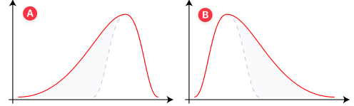
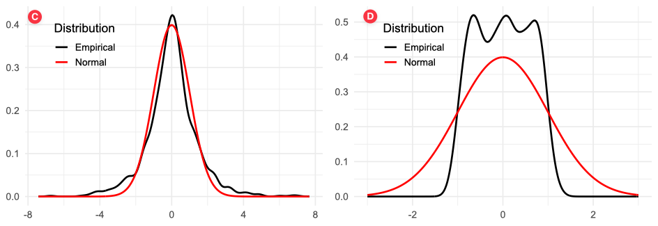

```{r child = "_setup.Rmd"}
source("Rscripts/fun_script.R")
```


# Agenda

.center-v[

.pull-layout-v.split-40-60[
.pull-left[
- Return Concepts
  - Simple and Log Returns
  - Relationship between the Two
  - Cumulative Returns Across Periods

- Risk Measures
  - Volatility
  - Calculating Portfolio Risk
  - Skewness and Kurtosis
  - Downside Risk Measures
]
.pull-right[
- Risk-adjusted Returns
  - Sharpe Ratio
  - Beta-adjusted Measures: Treynor and Jensen's Alpha
  - Information Ratio
  - Choosing the Right Measure
  - Risk Decomposition

- Empirical Case Study: ARKK against the S&P 500
]
]
]
---
class: inverse, center, middle
# Return Concepts 

---
.tight-top.tight-bottom[
## Review of Return Measures
]

Refer to "Stock market rate of return and their characteristics" by Sabina for details.

- **Simple Return**: $R_t$ measures the rate of return from $t-1$ to $t$. 
  $$\red{R_t} = \frac{P_t-P_{t-1}}{P_{t-1}} = \frac{P_t}{P_{t-1}}-1$$

- **Log Return**: $r_t$ is the continuously compounded return from $t-1$ to $t$.
  $$\red{r_t} = \ln P_t - \ln P_{t-1} = \ln \frac{P_t}{P_{t-1}}$$

- **Relationship**: 
  $$\red{r_t = \ln (R_t+1)} \Longleftrightarrow R_t = e^{r_t}-1$$

???
For example, an interest rate of $5\%$ payable every six months will be quoted as a simple interest of $10\%$ per annum in the market.

Notation update: following Sabina's notation, use $R_t$ for simple return and $z_t$ for log return. 

Previously, I used $r_t$ for simple return and $z_t$ for log return.

- Log return is the first difference of the natural logarithm of prices.

---
.tight-top[
### Relationship between Simple and Log Returns
]
.pull-layout-v.split-40-60[
.pull-left[
.center-v[
```{r log-return-plot, echo=FALSE, fig.width=7, fig.height=5, fig.retina=3, fig.cap="Figure: Relationship between Simple and Continuously Compounded Returns"}
library(ggplot2)
library(latex2exp)
library(scales)
# Data: simple return r_t and continuous return z_t
r_t <- seq(-1, 1, by = 0.001)
z_t <- log(1 + r_t)
df <- data.frame(r_t = r_t, z_t = z_t)

# Plot with ggplot2
ggplot(df, aes(x = r_t, y = z_t)) +
  geom_line(color = "blue", size = 1) +
  geom_abline(intercept = 0, slope = 1, color = "red", linetype = "dashed") +
  scale_x_continuous(limits = c(-1,1)) +
  scale_y_continuous(limits = c(-1,1)) +
  labs(
    x = TeX("Simple return $~R_t$"),
    y = TeX("Continuously compounded return $~r_t$")
  ) +
  theme_minimal(base_size = 14)
```
]
]


.pull-right[
**Portfolio return:**
- Simple return is additive across assets: $R_P = \sum_{i=1}^N w_iR_i$
- Log return is *not*: $r_p = \ln(R_P+1)$<sup>[1]</sup>

**Multiperiod Returns**

- For simple returns, the cumulative return from time $0$ to time $T$ is given by:
  $$R_{0:T} = \Pi_{t=1}^T (1+R_t) -1.$$

- Log return is additive across time:
  $$r_{0:T} = \sum_{t=1}^T r_t = \ln(R_{0:T}+1) .$$

.small-text[
<sup>[1]</sup>There is a *typo* in Sabina's notes page 5. Correct formula for *portfolio log return*: $r_P=\ln\left(\sum_{i=1}^N w_iR_i + 1\right)$
]
]
]

???

Simple returns aggregate across assets, log returns across time.

---
class: example-block
.small-text[
## Tracking Investment Performance Across Periods
]
Alex is tracking the performance of his investment over three consecutive periods. The simple rate of returns for each period are as follows:
$$[2\%, -1\%, 3\%]$$

(a) Calculate the **cumulative simple return** from period 0 to period 3.  
(b) Calculate the **cumulative log return** from period 0 to period 3.  
(c) Verify the relationship between the cumulative simple return and cumulative log return.

???

Simple return: $R_1=2\%,$ $R_2=-1\%,$ and $R_3=3\%.$

(a) $R_{0:3}=\Pi_{t=1}^3 (1+R_t) -1 = (1 + 0.02)(1 - 0.01)(1 + 0.03) - 1 \approx 4.05\%.$
(b) $r_{0:3}=\sum_{t=1}^3 r_t.$ Log return for each period: $r_1=ln(R_1+1)\approx 0.0198,$ $r_2=ln(R_2+1)\approx -0.0101,$ $r_3=ln(R_3+1)\approx 0.0296.$ 
    
    The cumulative log return $r_{0:3}=0.0198 - 0.0101 + 0.0296 \approx 3.93\%.$
(c) $e^{r_{0:3}}-1=e^0.0393-1\approx 4.01\%,$ is close to the cumulative simple return $R_{0:3}\approx 4.05\%.$

---
class: inverse, center, middle
# Risk Measures

---
## Volatility

The standard deviation of returns is usually called volatility.

$$\begin{aligned}
\text{Variance}: \sigma_p^2 &= \frac{1}{T-1} \sum_{t=1}^T (r_{p,t}-\bar{r}_p)^2 \\
\text{Volatility}: \sigma_p &= \sqrt{\sigma_p^2} \\
\text{Annualized Volatility}: \sigma_{p}^A &= \red{\sqrt{12}} \times \sigma_p \\
\end{aligned}$$

where we assume monthly portfolio returns $r_{p,t}$, $t=1,2,\ldots,T$.

---
class: example-block
## Calculating Portfolio Risk
Daniel is tracking his portfolio’s performance over the past 7 months. The monthly returns (in decimals) are:
$$[2\%,\; -1\%,\; 3\%,\; 0\%,\; -2\%,\; 1\%,\; 1.5\%]$$
He wants to understand how risky his portfolio is by calculating volatility and annualized volatility.

(a) Calculate the monthly volatility.  
(b) Calculate the annualized volatility.  

???

(a) The average monthly return is calculated as:
    $$\bar{r} = \frac{1}{7} \sum_{t=1}^{7} r_t = \frac{2 - 1 + 3 + 0 - 2 + 1 + 1.5}{7}\% \approx 0.643\%.$$
    The monthly volatility is calculated as:
    $$\begin{split}
    \sigma &= \sqrt{\frac{1}{T-1} \sum_{t=1}^{T} (r_t - \bar{r})^2} \\
    &= \sqrt{
      \frac{1}{6} 
      \Bigg(
      \begin{aligned}
      &(2-0.643)^2 + (-1-0.643)^2 + (3-0.643)^2 + (0-0.643)^2 \\
      & + (-2-0.643)^2 + (1-0.643)^2 + (1.5-0.643)^2
      \end{aligned}
      \Bigg)
      } \; \% \\
    &\approx \sqrt{3.06}\% \approx 1.75\%.
    \end{split}$$
(b) The annualized volatility is calculated as:
    $$\sigma^A = \sqrt{12} \times \sigma \approx \sqrt{12} \times 1.75\% \approx 6.06\%.$$

---
## Skewness and Kurtosis

- Skewness measures the asymmetry of the return distribution around its mean. It is the third (normalized) moment about the mean.
  - Positive skewness indicates a distribution with an asymmetric tail extending towards more positive values.
  - Negative skewness indicates a distribution with an asymmetric tail extending towards more negative values.

- Kurtosis measures the "tailedness" of the return distribution. It is the fourth (normalized) moment about the mean.
  - Kurtosis greater than 3 indicates a distribution with heavier tails than a normal distribution.
  - Kurtosis less than 3 indicates a distribution with lighter tails than a normal distribution.

---
class: example-block

## Recognize the Distribution Shape

.pull-left[
Which of the following distributions has 

- positive skewness, 
- negative skewness, 
- high kurtosis, and
- low kurtosis?
]

.pull-right[
<br>

]

???

A: negative skewness  
B: positive skewness
C: high kurtosis
D: low kurtosis

---

## Downside Risk Measures

When the return distribution is asymmetric (skewed), investors use additional risk measures that focus on describing the potential losses.

- The **Semi-Deviation** is the calculation of the variability of returns below the mean return.
  $$\begin{aligned}
  \text{Semi } \sigma_p &= \sqrt{\frac{1}{T-1}\textstyle \sum_{t=1}^T \big[\min(r_{p,t}-\bar{r}_p, 0)\big]^2 } \\
  \text{Annualized Semi } \sigma_p^A &= \text{Semi } \sigma_p \times \sqrt{12}
  \end{aligned}$$
  where $n$ is either the number of observations of the entire series or the number of observations in the subset of the series falling below the average.

---

## Downside Risk Measures

- **Value-at-Risk** (VaR) measures the potential loss in value of a risky asset or portfolio over a defined period for a given confidence interval.

  - A $\alpha$ VaR means that the probability of a loss greater than VaR is (at most) $(\alpha)$ while the probability of a loss less than VaR is (at least) $1-\alpha$.

      - For example, a one-day $1\%$ VaR of $1 million implies the portfolio has a $1\%$ chance that the value of the asset drops more than $1 million over one day.

      - In other words, there is a $99\%$ probability that the asset makes a profit or lose less than $1 million over a day.

  - Assuming normally distributed returns, the 1% VaR can be calculated as: 
    $$\text{VaR(1%)}=\text{Mean}-2.33\cdot \text{SD}$$
    where 2.33 is the critical value of the standard normal distribution at the 1% level.

  - To obtain a sample estimate of 1% VaR, sort the returns in ascending order and select the return at the $1$st percentile.

---

## Downside Risk Measures

.center-v[
- **Expected Shortfall** (ES) is the expected value of the loss, given the loss is greater than the VaR.
  $$\text{ES}(\alpha) = E[r_p \vert r_p \leq VaR(\alpha)]$$
  
  - Relationship with VaR: VaR is the most optimistic measure of bad-case outcomes as it takes the smallest loss of all these cases, while ES informs the expected loss given that we find ourselves in one of the worst-case scenarios. 
  
  - Using a sample of historical returns, we would estimate the 1% expected shortfall by identifying the worst 1% of all observations and taking their average.
]

???
-The VaR is the most optimistic measure of bad-case outcomes as it takes the highest return (smallest loss) of all these cases. In other words, it tells you the investment loss at the first percentile of the return distribution, but it ignores the magnitudes of potential losses even further out in the tail. 
- A more informative view of downside exposure would focus instead on the expected loss given that we find ourselves in one of the worst-case scenarios. 

---
class: example-block
## Calculating Downside Risk Measures

Sofia wants to measure the downside risk of her portfolio. She has collected the following monthly returns from her portfolio over ten months:
$$[3\%, -2\%, 5\%, -4\%, 1\%, -1\%, 2\%, -3\%, 4\%, -2\%]$$
<ol type="a">
  <li>Using the formula for <strong>semi-deviation</strong>, calculate Sofia’s monthly semi-deviation.</li>
  <li>Annualize Sofia’s semi-deviation using the formula for <strong>annualized semi-deviation</strong>.</li>
</ol>

???

(a) The mean return is $\bar{r} = \frac{1}{10} \sum_{t=1}^{10} r_t = \frac{3-2+5-4+1-1+2-3+4-2}{10}\% = 0.3\%.$

When calculating semi-deviation, we only consider the returns lower than $0.3\%$: $[-2\%, -4\%, -1\%, -3\%, -2\%].$
The monthly semi-deviation is calculated as:
$$\begin{split}
\text{Semi } \sigma &= \sqrt{\frac{1}{n-1} \sum_{t=1}^{n} [\min(r_t - \bar{r}, 0)]^2} \\
&= \sqrt{\frac{1}{9} 
      \Bigg(
      \begin{aligned}
      &(-2-0.3)^2 + (-4-0.3)^2 + (-1-0.3)^2 + (-3-0.3)^2 + (-2-0.3)^2
      \end{aligned}
      \Bigg)
      } \% \\
&= = \sqrt{4.628}\% \approx 2.15\%.
\end{split}$$

(b) The annualized semi-deviation is calculated as:
    $$\text{Annualized Semi } \sigma^A = \text{Semi }\sigma \times \sqrt{12} \approx 2.15\% \times \sqrt{12} \approx 7.45\%.$$

---
class: example-block, example-cont
## Calculating Downside Risk Measures

Recall Sofia’s ten monthly returns:
$$[3\%, -2\%, 5\%, -4\%, 1\%, -1\%, 2\%, -3\%, 4\%, -2\%]$$
<ol type="a" start="3">
  <li>Sofia now wants to compute a simple <strong>Value-at-Risk (VaR)</strong> at the 5% level. Assume her portfolio is worth $10 million and the monthly returns are <em>normally distributed</em> with mean equal to the sample mean and standard deviation equal to the semi-deviation you calculated. 
  <ul><li>What is her one-month 5% VaR in dollars? Critical values of standard normal distribution: \(z_{0.005}=2.58,\) \(z_{0.025}=1.96,\) \(z_{0.05}=1.64\) </li></ul>
  </li>
  <li>If Sofia’s one-month 5% VaR is the value you computed above, what does this mean in words about the probability of losses in her portfolio?</li>
</ol>

???

(c) Assume portfolio value $V = \dollar 10,000,000$, returns are normal with mean $\mu = 0.3\%$ and standard deviation $\sigma = 2.15\%$. The one-month 5% VaR is calculated as:
$$\begin{split}
\text{VaR}_{0.05} &= V \times (\mu - z_{0.05} \times \sigma) \\
&= 10,000,000 \times (0.3 - 1.645 \times 2.15)\% \\
&= 10,000,000 \times (-3.24)\% \\
&= -324,000.
\end{split}$$

(d) **Interpretation:** A one-month 5% VaR of $-\dollar 324,000$ means that there is a 5% probability that Sofia's portfolio will lose more than $324,000 in a single month. In other words, she can expect that in 95% of the months, her losses will not exceed $324,000.


---
class: inverse, center, middle
# Risk-adjusted Returns

---
## Sharpe Ratio

Sharpe ratio measures the portfolio's excess return per unit of standard deviation.

Assuming we observe **monthly returns**, $r_{p,t},$ $t=1,2,\ldots,n$, for a portfolio $p$ over $n$ months.

$$\begin{aligned}
\text{Sharpe Ratio} &= S_p = \frac{\bar{r}_p-\bar{r}_f}{\sigma_p} \\
\text{Annualized Sharpe Ratio} &= S_p^A = \frac{\bar{r}_p-\bar{r}_f}{\sigma_p} \times \sqrt{12}
\end{aligned}$$

where **both** means are **arithmetic**:

$$\bar{r}_p = \frac{1}{n}\sum_{t=1}^{n} r_{p,t}, \qquad \bar{r}_f = \frac{1}{n}\sum_{t=1}^{n} r_{f,t}$$

The Sharpe ratio comes from **single-period** mean-variance theory: the numerator estimates the one-period *expected* excess return, and the arithmetic mean is its unbiased estimator.

???
- Why not the geometric mean? It answers a different question -- realized compound growth -- and it has already been penalised for volatility, since $\bar{r}_G \approx \bar{r}_A - \sigma^2/2$. Putting it in the numerator and then dividing by $\sigma$ would charge the portfolio for its volatility twice.
- The $\sqrt{12}$ annualization assumes i.i.d. periodic returns and arithmetic means. It is not valid for geometric means.

---

## Beta Coefficient-adjusted Measures

An alternative risk measure is the beta coefficient based on the single index model:
<!-- Using Sabina's notation -->
$$r_p = \alpha_p + \beta_p r_m + \varepsilon_p$$

where $\beta_p=\frac{\cov(r_p, r_m)}{\var(r_m)}=\rho_{p,m}\frac{\sigma_p}{\sigma_m}.$ 

<!-- $$r_{i,t} - r_{f,t} = \alpha_i + \beta_i \,(r_{m,t} - r_{f,t}) + \varepsilon_{i,t} .$$
The OLS $\beta_i$ estimate can be expressed as

$$\hat{\beta}_i = \frac{\text{Cov}(R_{i}^e, R_{m}^e)}{\text{Var}(R_{m}^e)}$$
where 

- $R^e_i=r_i-r_f$ stands for the excess return on asset $i$, and
- $R^e_m=r_m-r_f$ stands for the excess return on the market index.

In practice, beta can be estimated using raw returns rather than excess returns, i.e.,
$$\hat{\beta}_i = \frac{\text{Cov}(r_i, r_m)}{\text{Var}(r_m)} .$$ -->


- **Treynor ratio** is a variant of Sharpe ratio. It substitute the standard deviation in Sharpe ratio with the beta coefficient.
  $$\text{Treynor Ratio}_p = \frac{\bar{r}_p-\bar{r}_f}{\beta_p}$$

- **Jensen's alpha** measures the average return on the portfolio in excess of what predicted by the CAPM, given the portfolio's beta and the average market return.
  $$\alpha_p^J = \bar{r}_p - \left[\bar{r}_f + \beta_p (\bar{r}_m - \bar{r}_f)\right]$$
  - Differentiate Jensen's alpha from the alpha coefficient in the single index model. The former is a performance measure, while the latter is a regression coefficient.
  - In performance evaluation, "Alpha" means Jensen's alpha, unless otherwise specified.
  <!-- $$\alpha_p = \bar{r}_p - \left[\bar{r}_f + \beta_p(\bar{r}_m-\bar{r}_f)\right]$$ -->


???
- The only relevant risk in the computation of the Treynor ratio is **systematic risk**. It assumes that the portfolio is fully diversified. Appropriate for diversified equity funds, the element of unsystematic risk would be negligible.

- Sharpe ratio assumes that the relevant risk is total risk (systematic and unsystematic risk), and it measures excess return per unit of total risk. It is appropriate for the portfolio that is less diversified.

- Jensen's alpha also assumes that the relevant risk is systematic risk.

**Notation disclaimer**: I followed Sabina's notation, using raw returns rather than excess returns in the single index model. One consequence is that the alpha coefficient in the single index model is not equal to Jensen's alpha. 

If following my previous notation, express the single index model using excess returns:
$$r_{i,t} - r_{f,t} = \alpha_i + \beta_i \,(r_{m,t} - r_{f,t}) + \varepsilon_{i,t}$$
Then the alpha coefficient in the single index model is equal to Jensen's alpha. → Less room for confusion. Sabina's notation risks confusion btw alpha coefficient in the single index model and Jensen's alpha.

For **next year**: use excess returns following the BKM textbook.

---
## Information Ratio

The **information ratio**, on the other hand, measures the portfolio performance <u>against a comparable benchmark</u> rather than the risk-free rate. 

The information ratio is the active return per unit of active risk. It measures the excess return per unit of nonsystematic risk that in principle could be diversified away by holding a market index ­portfolio.

Assuming we observe **monthly returns**, $r_{p,t},$ $t=1,2,\ldots,n$, for a portfolio $p$ over $n$ months, and the corresponding benchmark returns $r_{m,t}$. $\sigma_{p-m}$ is the standard deviation of the return *difference* $r_{p,t}-r_{m,t}$ (**the tracking error**).

$$\begin{aligned}
\text{Information Ratio} &= \text{IR}_p = \frac{\bar{r}_p-\bar{r}_m}{\sigma_{p-m}} \\
\text{Annualized Information Ratio} &= \text{IR}_p^A = \frac{\bar{r}_p-\bar{r}_m}{\sigma_{p-m}} \times \sqrt{12}
\end{aligned}$$

You may also see the information ratio expressed as the ratio of the portfolio's alpha to its tracking error. But here we use the definition above.

---
class: example-block
.tight-top.tight-bottom.small-text[
## Calculate Beta Coefficient-adjusted Measures
]

Given the following information about the return on a portfolio, the market index and risk free returns.

<div style="height:3px;"><br></div>

.pull-layout[
.pull-left[
```{r beta-measures-table, echo=FALSE}
# The returns are the data; every summary row below is derived from them, so the
# table cannot drift out of step with itself.
returns <- tibble(
  Year      = as.character(1:10),
  Portfolio = c(14, 10, 19, -8, 23, 28, 20, 14, -9, 19),
  Market    = c(12,  7, 20, -2, 12, 23, 17, 20, -5, 16),
  Active    = Portfolio - Market,
  RiskFree  = c(2.4, 2.9, 3.1, 2.9, 3.9, 3.4, 2.7, 2.4, 2.9, 3.4)
)
# Returns are in percentage points, so dividing by 100^2 puts the covariance
# back into decimals - the units beta needs.
cov_pm <- cov(returns$Portfolio, returns$Market) / 1e4

pct <- function(x, d) paste0(formatC(x, format = "f", digits = d), "%")

tbl <- rbind(
  data.frame(Year      = returns$Year,
             Portfolio = pct(returns$Portfolio, 0),
             Market    = pct(returns$Market,    0),
             Active    = pct(returns$Active,    0),
             RiskFree  = pct(returns$RiskFree,  1)),
  data.frame(Year      = "Average",
             Portfolio = pct(mean(returns$Portfolio), 0),
             Market    = pct(mean(returns$Market),    0),
             Active    = pct(mean(returns$Active),    0),
             RiskFree  = pct(mean(returns$RiskFree),  1)),
  data.frame(Year      = "Standard deviation",
             Portfolio = pct(sd(returns$Portfolio), 2),
             Market    = pct(sd(returns$Market),    2),
             Active    = pct(sd(returns$Active),    2),
             RiskFree  = pct(sd(returns$RiskFree),  2)),
  data.frame(Year      = "Cov(\\(r_p\\), \\(r_m\\))",
             Portfolio = formatC(cov_pm, format = "f", digits = 4),
             Market    = "",
             Active    = "",
             RiskFree  = "")
)

kable(tbl, format = "html", escape = FALSE, row.names = FALSE,
      align = c("c", "r", "r", "r", "r"),
      col.names = c("Year", "Portfolio", "Market index",
                    "\\(r_p - r_m\\)", "Risk free rate")) %>%
  kable_styling(full_width = FALSE, font_size = 16,
                bootstrap_options = "condensed", position = "left") %>%
  row_spec(10, extra_css = "border-bottom: 1px solid #bbb;")
```
]

.pull-right[
- Calculate the beta.
- Calculate the Sharpe ratio.
- Calculate the information ratio.
- Calculate the Treynor ratio.
- Calculate Jensen’s Alpha.
]
]

---

## Choosing the Right Measure

The measures differ in what they treat as "risk", so they answer different questions.

| Measure | Definition | Use it when |
| ------- | ---------- | ----------- |
| Sharpe / $M^2$ | $\dfrac{\bar{r}_P-\bar{r}_f}{\sigma_P}$ | The portfolio is your **entire** risky holding |
| Treynor | $\dfrac{\bar{r}_P-\bar{r}_f}{\beta_P}$ | The portfolio is **one of many** sub-portfolios in a diversified fund |
| Information ratio | $\dfrac{\bar{r}_p-\bar{r}_m}{\sigma_{p-m}}$ | The portfolio is an **active position added to a passive index** |


???
- The denominator $\sigma(e_P)$ is what the industry calls *tracking error*.
- Note the terminology trap: some practitioners define the information ratio as excess return over the benchmark divided by tracking error, and reserve *appraisal ratio* for alpha over tracking error. Both definitions are in circulation.

---
class: example-block
## The Measures Can Disagree

Over a sample period a portfolio $P$ and the market index $M$ produced:

.pull-layout[
.pull-left[
|  | Portfolio $P$ | Market $M$ |
| ---- | ----: | ----: |
| Average return | $35\%$ | $28\%$ |
| Beta | $1.20$ | $1.00$ |
| Standard deviation | $42\%$ | $30\%$ |
| Tracking error $\sigma_{p-m}$ | $18\%$ | $0$ |

The T-bill rate was $6\%$.
]
.pull-right[
(a) Compute the Sharpe ratio, Treynor ratio, Jensen's alpha and information ratio for $P$ and $M$.

(b) By which measures does $P$ beat the market? By which does it lose?
]
]

???
- Sharpe: $P = 29/42 = 0.690$ against $M = 22/30 = 0.733$ -- **$P$ loses**.
- $M^2 = 30 \times (0.690 - 0.733) = -1.29\%$ -- same verdict, as it must be.
- Treynor: $29/1.2 = 24.17$ against $22$ -- **$P$ wins**.
- Alpha: $35 - [6 + 1.2(28-6)] = 2.6\%$; information ratio $= 2.6/18 = 0.144$ -- **$P$ wins**.
- The resolution: $P$ carries a lot of diversifiable risk. As a stand-alone portfolio that risk is real and it loses. As a small satellite position beside an index fund, the diversifiable part washes out and its positive alpha is worth having.

---

## Risk decomposition

Total risk can be decomposed into systematic and specific risk.

- **Specific risk** is the annualized standard deviation of the error term in the CAPM regression equation.

  Systematic risk, as defined by Bacon (2008), is the product of beta by market risk.
  $$\sigma_s = \beta * \sigma_m$$
  Market risk, $\sigma_m$, is the annualized standard deviation of the benchmark. $\beta$ is the regression beta.

- Total risk is given by:
  $$\text{Total Risk} = \sqrt{\text{Systematic Risk}^2 + \text{Specific Risk}^2}$$

---

class: inverse, center, middle
# Empirical Case Studies

---
## An Active ETF against its Benchmark

**ARK Innovation (ARKK)**, an actively managed ETF, measured against **SPY**
(the S&P 500) and the risk-free rate, over **120 months (2015--2024)**.

Data Preview:

```{r case-load, echo=FALSE}
library(PerformanceAnalytics)
library(xts)

ret <- read.csv("data/etf_ARKK_case_study_monthly.csv")
ret$Date <- as.Date(ret$Date)
ret_xts <- xts(ret[, c("ptf_ret", "bmk_ret")], order.by = ret$Date)
colnames(ret_xts) <- c("ARK Innovation", "S&P 500")
rf_xts <- xts(ret$rf, order.by = ret$Date)
colnames(rf_xts) <- "rf"
```

```{r case-head, echo=FALSE}
# first and last three months: the risk-free rate is exactly zero in 2015 and
# well above 4% by 2024, so both ends are worth seeing
shown <- rbind(head(ret, 5), NA, tail(ret, 5))
shown$Date <- format(shown$Date)
shown %>% 
mutate(across(2:4, ~ percent(.x, accuracy = 0.01))) %>%
  kable(format = "html", row.names = FALSE, digits = 4,
      col.names = c("Date", "Portfolio", "Benchmark", "Risk free"),
      align = "r") %>%
  kable_styling(full_width = FALSE, font_size = 16,
                bootstrap_options = "condensed", position = "left")
```

???
- Everything that follows needs only these three series: the fund, a benchmark, and a risk-free rate.
- 120 months is a long track record by industry standards, and, as we will see, still far too short to judge skill.

---
.tight-top.tight-bottom.tight-heading[
## Return Visualization
]

Return figures can be generated by `PerformanceAnalytics::charts.PerformanceSummary`. It stacks three figures: the **cumulative return**, the **monthly return**, and the **drawdown** from the running peak.

```{r case-summary, echo=FALSE}
# plot_png_base() and trim_png() live here; sourced this late in the deck so
# the theme_set() at the end of fun_script.R cannot restyle earlier figures
source("Rscripts/fun_script.R")
f_name <- "images/etf_ret_summary.png"
plot_png_base(
  charts.PerformanceSummary(ret_xts,
    main = "", legend.loc = "topleft",
    colorset = c("#b2182b", "#43418A")
  ),
  f_name, 9, 7
)
```

.pull-layout-v.split-60-40[
.pull-left[
```{r case-summary-png, echo=FALSE, out.width="100%"}
# shown above, not run here: Rscripts/ptf_performance.R section 4 writes the
# png with plot_png_base(), so the deck only has to include it
f_name <- "images/etf_ret_summary.png"
include_graphics(f_name)
```
]
.pull-right.small-text[
- At the 2021 peak the fund was worth **3.7 times** the benchmark; by the end of
2024 it is **behind** it. The drawdown panel shows a fall of $77\%$ from which
it has still not recovered.
- **Drawdown**: It is the level of losses from the last value of peak equity attained.
  $$D_t = \frac{V_t-\text{max}_{s<t}V_s}{\text{max}_{s<t}V_s}$$
  where $V_t=\Pi_{s=1}^t(1+R_S)$ is the cumulative portfolio value at time $t$ and $\text{max}_{s<t}V_s$ is the maximum cumulative portfolio value attained prior to time $t$.
- **Maximum Drawdown**(MDD): minimum value of the drawdown over a specified time period.
  $$\text{MDD} = \min_t(D_t)$$
]
]

???
- `charts.PerformanceSummary` stacks three views: the wealth index, the monthly returns, and the drawdown from the running peak.
- The drawdown panel is the one investors actually feel. Neither the Sharpe ratio nor alpha tells you "down 77% and still under water three years later".

---
.tight-top.tight-bottom.small-text[
## Summary Statistics
]

```{r case-stats, echo=FALSE}
stats <- table.Stats(ret_xts, digits = 4)
```

.pull-layout-v.split-40-60[
.pull-left[
.center-v[
```{r case-stats-print, echo=FALSE}
kable(stats[-c(2),], format = "html", digits = 4) %>%
  kable_styling(full_width = FALSE, font_size = 17,
                bootstrap_options = "condensed", position = "left")
```
]
]
.pull-right[
Use `PerformanceAnalytics::table.Stats` to generate a table of summary statistics for the two return series.

- `SE Mean`: Standard Error of the average return. 
   $$\text{SE Mean} = \frac{\sigma_p}{\sqrt{T}}$$

- `LCL Mean`: Lower Confidence Level (LCL) of the mean, defaults to 95% confidence level.
   $$\text{LCL Mean} = \bar{r}_p - \text{SE Mean} \times c_{\alpha/2}$$
   where $c_{\alpha/2}$ is the critical value, i.e., $\left(1-\frac{\alpha}{2}\right)$ quantile of the $t$ distribution with $(T-1)$ degrees of freedom.

- `UCL Mean`: Upper Confidence Level (UCL) of the mean, defaults to 95% confidence level.
   $$\text{UCL Mean} = \bar{r}_p + \text{SE Mean} \times c_{\alpha/2}$$

- `Kurtosis`: Excess Kurtosis.

]
]


---

# Downside risk measures

.pull-layout-v.split-40-60[
.pull-left[
.center-v[
```{r case-downside, echo=FALSE}
alpha <- 0.05
table_downside <- rbind(
    stats["Stdev", ],
    SemiDeviation(ret_xts),
    VaR(ret_xts, p = alpha),
    ES(ret_xts, p = alpha)
  ) %>% 
  as.data.frame()

table_downside %>% 
  `rownames<-`(c("Stdev", "Semi-Deviation",
                 sprintf("VaR(%s)", percent(alpha)),
                 sprintf("ES(%s)",  percent(alpha)))) %>% 
  mutate_all(~ percent(.x, accuracy = 0.01)) %>%
  kable(format = "html", align = "r") %>% 
  kable_styling(full_width = FALSE, font_size = 20,
                bootstrap_options = "condensed")

```
]
]
.pull-right[
- **Standard deviation** measures total risk; **semi-deviation** only the downside volatility.

- $\red{\text{VaR(5%)}_{\text{ARK}}=14.87\%}$: There is a 5% chance that ARK loses more than
  `r percent(table_downside[3, 1], accuracy = 0.01)` over one month. Or, equivalently, there is a 95% chance that ARK loses less than `r percent(table_downside[3, 1], accuracy = 0.01)` over one month. The index's VaR is `r percent(table_downside[3, 2], accuracy = 0.01)`.

- $\red{\text{ES(5%)}_{\text{ARK}}=18.97\%}$: *given* that ARK is in the worst 5% of months, it will lose on average `r percent(table_downside[4, 1], accuracy = 0.01)`. The index's ES is `r percent(table_downside[4, 2], accuracy = 0.01)`.

]
]
???
- All three downside measures put the fund at roughly twice the index ($2.36\times$ on $\sigma$, $2.27\times$ on VaR, $2.08\times$ on ES), so here they tell the same story that the standard deviation already told. They earn their keep when the distribution is strongly skewed, which this one is not.
- Note the semi-deviation ratios line up with the skewness from the summary-statistics slide: the fund is positively skewed ($+0.22$) so its downside is *milder* than symmetry implies, the index negatively skewed ($-0.39$) so its downside is worse.

---
## Risk-adjusted Performance

```{r case-measures, echo=FALSE}
sharpe <- SharpeRatio.annualized(ret_xts, Rf = rf_xts, geometric = FALSE)
capm <- table.CAPM(Ra = ret_xts[, 1], Rb = ret_xts[, 2],
                   Rf = rf_xts$rf, scale = 12, digits = 4)
```

- Use `PerformanceAnalytics::SharpeRatio.annualized` to compute the Sharpe ratio.
- Use `PerformanceAnalytics::table.CAPM` to compute the beta, Treynor and Information ratios.

.pull-layout[
.pull-left[
```{r case-measures-print, echo=FALSE}
kable(rbind(sharpe,
            `Beta` = c(capm["Beta", ], 1),
            `Annualized Alpha` = c(capm["Annualized Alpha", ], 0),
            `R-squared` = c(capm["R-squared", ], 1)),
      format = "html", digits = 3) %>%
  kable_styling(full_width = FALSE, font_size = 20,
                bootstrap_options = "condensed", position = "left")
```
]
.pull-right[
```{r case-measures-print2, echo=FALSE}
kable(capm[c("Tracking Error", "Active Premium",
             "Information Ratio", "Treynor Ratio"), , drop = FALSE],
      format = "html", digits = 3) %>%
  kable_styling(full_width = FALSE, font_size = 20,
                bootstrap_options = "condensed", position = "left")
```
]
]

The fund loses on **every** measure: lower Sharpe ratio, negative alpha,
negative information ratio.

???
- `table.CAPM` defines the information ratio as active premium / tracking error, where the active premium uses *geometric* annualized returns. Computing it from the arithmetic mean of the monthly active return gives +0.16 instead: the fund's arithmetic average active return is positive, but its compounded one is not. Same volatility drag as two slides ago.

---

## Performance by Year

```{r echo=FALSE}
library(scales)
table_by_year <- function(R, Rf) {
  yr <- mapply(function(r, rf) table.AnnualizedReturns(r, Rf = rf),
    split(R, f = "years"), # xts::split.xts
    split(Rf, f = "years"),
    SIMPLIFY = FALSE
  )
  out <- do.call(cbind, yr)
  colnames(out) <- unique(format(index(R), "%Y"))
  # the Rf in the Sharpe row label comes from the first year only -- drop it,
  # since each column was computed against its own year's risk-free rate
  rownames(out)[3] <- "Annualized Sharpe"
  t(out)
}

performance_by_year <- table_by_year(ret_xts$`ARK Innovation`, rf_xts$rf)
performance_by_year %>% 
  as.data.frame() %>% 
  mutate(
    across(
      c(`Annualized Return`, `Annualized Std Dev`),
      ~ percent(.x, accuracy = 0.01)
    ),
    `Annualized Sharpe` = number(`Annualized Sharpe`, accuracy = 0.01)
  ) %>%
  kable(format = "html", align = 'r') %>%
  kable_styling(full_width = FALSE, font_size = 17,
                bootstrap_options = "condensed")
```

---
.tight-top.tight-bottom[
## Rolling Performance
]
```{r rolling-performance, echo=FALSE}
f_name <- "images/etf_ret_rolling.png"
plot_png_base(
  charts.RollingPerformance(R = ret_xts,Rf = rf_xts$rf, width = 12, 
  legend.loc = "topleft", colorset = c("#b2182b", "#43418A")),
  f_name, 9, 7
)
```

.pull-layout-v.split-60-40[
.pull-left[
```{r rolling-performance-png, echo=FALSE, out.width="100%"}
# shown above, not run here: Rscripts/ptf_performance.R section 4 writes the
# png with plot_png_base(), so the deck only has to include it
include_graphics(f_name)
```
]
.pull-right[
.center-v[
Return figures can be generated by `PerformanceAnalytics::charts.RollingPerformance`. It stacks three figures: the **rolling annualized** return, standard deviation, and Sharpe Ratio.
]
]
]

---
## Risk Decomposition

Use `PerformanceAnalytics::table.SpecificRisk` to decompose the total risk into systematic and specific risk.

```{r case-risk, echo=FALSE}
risk <- table.SpecificRisk(Ra = ret_xts[, 1], Rb = ret_xts[, 2],
                           Rf = rf_xts$rf, digits = 4)
```


.pull-layout-v.split-40-60[
.pull-left[
.center-v[
```{r case-risk-print, echo=FALSE}
kable(risk, format = "html", digits = 3) %>%
  kable_styling(full_width = FALSE, font_size = 17,
                bootstrap_options = "condensed", position = "left")
```
]
]
.pull-right[
- Note $\sigma_p^2 = \beta_p^2\sigma_m^2 + \sigma^2(e_p)$, i.e.
$0.362^2 \approx 0.261^2 + 0.250^2$.
- $R^2 = 0.52$: only **half** of the fund's variation is explained by the market.
- The other half is **firm-specific risk**, which carries no expected reward. It
is what drags the Sharpe ratio down while leaving the beta-based measures
untouched.
]
]


---
## What the Measures Say

.pull-layout[
.pull-left[
| | ARK | S&P 500 |
| ---- | ----: | ----: |
| Annualized return | $12.2\%$ | $\mathbf{13.0\%}$ |
| Annualized SD | $\mathbf{36.2\%}$ | $15.3\%$ |
| Sharpe ratio | $0.451$ | $\mathbf{0.771}$ |
| Beta | $1.705$ | $1.000$ |
| Annualized $\alpha$ | $\mathbf{-3.8\%}$ | $0$ |
| Treynor ratio | $0.061$ | $0.118$ |
| Information ratio | $-0.030$ | -- |
]
.pull-right[
**For once, every measure agrees.** The fund lost to its benchmark on raw
return, on total risk, on systematic risk, and head-to-head. Ten years of
$27\%$ tracking error bought nothing.

**Yet the alpha is not statistically distinguishable from zero:** over 120
months its *t*-statistic is only $-0.47$ ($p = 0.64$).
]
]

Ten years of data, and the verdict on *skill* is still "we cannot tell".

???
- Contrast with the textbook example earlier: there the measures disagreed, because the portfolio had a positive alpha but poor total-risk performance. Agreement is the easy case.
- The honest conclusion is the second point. Even ten years cannot separate a -3.8% alpha from noise when tracking error is 27%. This is the practical reason performance evaluation is so hard, and why so much weight is put on process rather than on realized returns.
