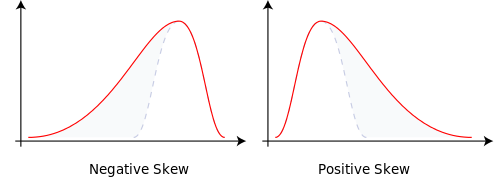

```{r setup, include=F, echo=F}
library(knitr) # load packages
library(kableExtra)
library(tidyverse)
library(bookdown)
# don't show code unless we explicitly set echo = TRUE
opts_chunk$set(echo = TRUE, message=FALSE, fig.align="center", fig.pos = "H")
opts <- options(knitr.kable.NA = "")

## control long outputs by using eg `max.lines = 10`
hook_output_default <- knitr::knit_hooks$get('output')
truncate_to_lines <- function(x, n) {
   if (!is.null(n)) {
      x = unlist(stringr::str_split(x, '\n'))
      if (length(x) > n) {
         # truncate the output
         x = c(head(x, n), '...\n')
      }
      x = paste(x, collapse = '\n') # paste first n lines together
   }
   x
}
knitr::knit_hooks$set(output = function(x, options) {
   max.lines <- options$max.lines
   x <- truncate_to_lines(x, max.lines)
   hook_output_default(x, options)
})
```


## Return Concepts

### Simple returns

$r_t$ measures the rate of return from $t-1$ to $t$. 
It is the percentage change in price given by:

$$
r_t = \frac{P_t-P_{t-1}}{P_{t-1}} = \frac{P_t}{P_{t-1}}-1
$$

One commonly used equality is

$$
P_t = P_{t-1} (1+r_t)
$$


### Continuously compounded returns

$z_t$ measures the log return, also referred to as continuously compounded return.
It is the first difference of the natural logarithm of prices.

$$
z_t = \ln P_t - \ln P_{t-1} = \ln \frac{P_t}{P_{t-1}}
$$

The **conversion** between log return and simple return:

$$
\begin{aligned}
\color{red}{z_t} &\color{red}{= \ln (1+r_t) }\\
r_t &= e^{z_t} -1
\end{aligned}
$$

Q: Why is $z_t$ continuously compounded return?

A: This is related to the constant $e$, Euler number.

The discovery of the constant itself is credited to Jacob Bernoulli, who attempted to find the value of the following expression:

$$
e = \lim_{n\to\infty} \left( 1 + \frac{1}{n} \right)^n
$$


If you put $\$100$ in a bank with an annual interest rate of $10\%$ and a yearly compounding period. What you get in a year can be expressed as follows:

$$
D_t = D_0 \left(1+\frac{R}{n}\right)^{nt} = 100\times \left(1+\frac{10\%}{1}\right)^{1\times1} = 110
$$
Note that 

$\quad$ $D_0$ is the initial deposit, \
$\quad$ $D_t$ is the value of the deposit at time $t$, \
$\quad$ $R$ is the annual percentage rate (APR), \
$\quad$ $n$ is the number of compounding periods in one year, \
$\quad$ $t$ is the number of years from $D_0$ to $D_t$. 


(For a bank deposit account, the quoted interest rate often refers to as "simple interest" which ignores compounding. For example, an interest rate of $5\%$ payable every six months will be quoted as a simple interest of $10\%$ per annum in the market.)

Q: What if we compound semi-annually?

A: That is when $e$ equals 2.

$$
D_t = 100\times(1+\frac{10\%}{2})^{2\times1} = 110.25
$$


What if we compound monthly? $\rightarrow$ $n=12$

$$
D_t = 100\times(1+\frac{10\%}{12})^{12\times1} = 110.47
$$

What if we compound daily?  $\rightarrow$ $n=365$

$$
D_t = 100\times(1+\frac{10\%}{365})^{365\times1} = 110.52
$$


$\left(1+\frac{R}{n}\right)^{nt}$ can be rewritten as $\left(1+\frac{1}{\frac{n}{R}}\right)^{\frac{n}{R} \cdot R \cdot t}$. We have

$$
\left(1+\frac{1}{\frac{n}{R}}\right)^{\frac{n}{R} \cdot R \cdot t} \to e^{Rt}
$$
as $\frac{n}{R}\to \infty$.

Under continuous compounding, 

$$
\color{red} {D_t = D_0\, e^{Rt}} .
$$


```{r}
R <- 0.1 # annual interest rate
t <- 1   # total time period

n <- 2 # compound frequency in one year
100 * (1+R/n)^{n*t}

n <- 12
100 * (1+R/n)^{n*t}

n <- 365
100 * (1+R/n)^{n*t}

100 * exp(R*t)
```

Note that 

- $D_t$ under continuous compounding is always larger than those of under fixed compounding frequencies. The higher the frequency, the larger the end value $D_t$ is. This is due to the earnings from "interest-on-interest".

- $\left(1+\frac{R}{n}\right)^{n}-1$ is the effective interest rate. This is the interest rate you get as a proportion to the amount you put in and it depends on the frequency of compounding.

- Continuously compounded interest rate is the effective interest rate when compounded continuously $(n\to\infty).$

<div class = "boxed">
```{exercise, proof1}

<em>Show $\ln (1+x) \approx x$ as $x\to 0$.</em>
    
Let $f(x)=\ln (1+x)$, its first-order Taylor expansion at $x$ close to $0$ is:
    
$$
\begin{aligned}
f(x) \approx f(0) + f^\prime(0)(x-0)
\end{aligned}
$$

The first derivative of $f(x)$ is

$$
f^\prime(x) = \frac{1}{1+x}.
$$

Hence

$$
\begin{aligned}
f(x) &\approx f(0) + f^\prime(0)(x-0) \\
&= \ln(1) + 1\cdot x  \\
&= x.
\end{aligned}
$$

<span style='margin-top:-2em; float:right'>$\square$</span>
```
</div>

**From prices to returns.**

```{r}
f_name <- "data/Titlon_equity_price_2014-2023_daily.csv"
titlon_data <- read_csv(f_name)
## group by ISIN, calculate returns
titlon_group <- titlon_data %>% group_by(ISIN)
groups <- titlon_group %>% group_split()
group_key <- titlon_group %>% 
    group_keys() %>% 
    mutate(id = row_number())
group_key
```


```{r}
# subset companies with more than 3 years' data
isin_vec <- titlon_group %>% tally() %>% 
    filter(n>(252*3)) %>% 
    pull(ISIN)
id_vec <- sapply(isin_vec, function(isin) which(group_key$ISIN==isin))
# data for one equity
i <- 4
groups[[id_vec[i]]]
groups[[id_vec[i]]] %>% tail()
```


```{r}
the_group <- groups[[id_vec[i]]] 
the_group
ticker <- the_group$Symbol[1]
ticker
the_group$Name[1]

# convert to xts
library(quantmod)
the_group_xts <- xts(the_group[,c("AdjustedPrice")], order.by=the_group$Date)
# the_group_xts <- xts(the_group[,c("Price")], order.by=the_group$Date)
the_group_xts %>% str()
the_group_xts

# from daily to monthly
prices_monthly <- the_group_xts %>% to.monthly(indexAt = "last", OHLC=FALSE)
prices_monthly %>% head(20)
prices_monthly %>% tail(20)
# price plot
plot(prices_monthly, main = sprintf("Monthly Price: %s", ticker))

# calculate monthly return by hand 
simple_ret <- (diff(prices_monthly)/lag(prices_monthly)) %>% setNames("simple_return") # simple return
log_ret <- diff(log(prices_monthly)) %>% setNames("log_return")   # log return, aka, continuously compounded return
merge(prices_monthly, simple_ret, log_ret)
```


```{r}
# calculate monthly return using `PerformanceAnalytics::Return.calculate`
library(PerformanceAnalytics)
merge(Return.calculate(prices_monthly, method = "discrete"),
      Return.calculate(prices_monthly, method = "log") ) %>%
    fortify() %>% 
    setNames(c("Date", "Simple Ret", "Log Ret")) %>% 
    knitr::kable(digits = 5, escape=F, caption="Using `PerformanceAnalytics::Return.calculate`") %>%
    kable_styling(bootstrap_options = c("striped", "hover"), full_width = F, latex_options="scale_down") %>% 
    scroll_box(height = "500px")
```


### Cumulative returns 

For simple return, the cumulative return from time $0$ to time $T$ is given by:

$$
r_{0:T} = \Pi_{t=1}^T (1+r_t) -1.
$$

For log return

$$
z_{0:T} = \sum_{t=1}^T z_t
$$

Note that we have to back out the simple return from the log return

$$
r_{0:T} = \exp(z_{0:T}) -1
$$


```{r simple-ret, fig.width = 8.93, fig.height = 14.51, fig.cap="Simple returns"}
return_monthly_simple <- Return.calculate(prices_monthly, method = "discrete")
return_monthly_simple[1,] <- 0
cumulative_returns_simple <- cumprod(1 + return_monthly_simple) - 1
# plot price, monthly ret, and cumu ret
par(mfrow=c(3,1))
plot(prices_monthly, main = sprintf("Monthly adjPrice: %s", ticker))
plot(return_monthly_simple, 
     main = sprintf("Monthly Return: %s", ticker))
plot(cumulative_returns_simple, 
     main = sprintf("Monthly Cumulative Return: %s", ticker))
```


```{r log-ret, fig.width = 8.93, fig.height = 14.51, fig.cap="Log returns"}
return_monthly_log <- Return.calculate(prices_monthly, method = "log")
return_monthly_log[1,] <- 0
cumulative_returns_log <- exp(cumsum(return_monthly_log)) - 1 # back out the simple return
par(mfrow=c(3,1))
plot(prices_monthly, main = sprintf("Monthly adjPrice: %s", ticker))
plot(return_monthly_log, 
     main = sprintf("Monthly Return: %s", ticker))
plot(cumulative_returns_log, 
     main = sprintf("Monthly Cumulative Return: %s", ticker))
```


The two types act very differently when it comes to aggregation.  Each has an advantage over the other:

- simple returns aggregate across assets \
The simple return of a portfolio is the weighted sum of the simple returns of the constituents of the portfolio.

- log returns aggregate across time \
The log return for a time period is the sum of the log returns of partitions of the time period.  For example, the log return for a year is the sum of the log returns of the days within the year.


### Multiperiod returns

Multiperiod returns are the generalized case of cumulative return by allowing any holding period $k\le T$. 

The $k$-period simple return from time $t-k$ to $t$ is given by

$$
r_{t}(k) = \frac{P_t-P_{t-k}}{P_{t-k}}.
$$

It can be expressed as in terms of one-period returns as follows:

$$
\begin{aligned}
r_t(k) &= \prod_{j=0}^{k-1}(1+r_{t-j}) -1 \\
&= (1+r_t)(1+r_{t-1})\cdots (1+r_{t-k+1})-1 .
\end{aligned}
$$

We always like to talk in terms of annual performance as people like to know how much they can expect to make a year in percentage terms. That is why in most of the fund reports, you will find a standard metric called **annualized returns**. It is also known as the *Compound Annual Growth Rate* (CAGR) or the *Geometric Annual Return*.

*Annualized return* under simple returns $r_t^A$ is given by:

$$
\begin{split}
(1+r_t^A)^k &= 1+r_t(k) \\
r_t^A &= \big(1+r_t(k) \big)^{\frac{1}{k}}-1 = \left[\prod_{j=1}^{k-1}(1+r_{t-j})\right]^{\frac{1}{k}}-1 .
\end{split}
$$


The $k$-period log return is given by

$$
z_t(k) = \ln \frac{P_t}{P_{t-k}}.
$$

It is the sum of the $k$ one-period log returns:

$$
z_t(k) = \sum_{j=0}^{k-1} z_{t-j} = z_t + z_{t-1} + \cdots + z_{t-k+1}
$$

*Annualized return* under continuously compounding $z_t^A$ is given by:

$$
\begin{aligned}
k\,z_t^A &= z_t(k) \\
z_t^A &= \frac{1}{k}z_t(k) = \frac{1}{k} \sum_{j=0}^{k-1} z_{t-j},
\end{aligned}
$$
which is the average one-period log returns.


To summarize in one table

|               | Simple returns    | Log returns     | Back out simple returns |
| -------------------------- | :------------------------------------------------------- | :---------------------------------------------- | :---------------------------------------------- |
| Single period | $r_t=\frac{P_t}{P_{t-1}}-1$  | $z_t=\ln \frac{P_t}{P_{t-1}}$  | $r_t = \exp(z_t)-1$ |
| Multiperiod   | $r_t(k) = \prod_{j=1}^{k-1}(1+r_{t-j}) -1$   | $z_t(k) = \sum_{j=0}^{k-1} z_{t-j}$  | $r_t(k) = \exp\big(z_t(k)\big)-1$ |
| Annualized    | $r_t^A = \left[\prod_{j=1}^{k-1}(1+r_{t-j})\right]^{\frac{1}{k}}-1$ | $z_t^A = \frac{1}{k} \sum_{j=0}^{k-1} z_{t-j}$ | $r_t^A = \exp(z_t^A)-1$ |


Note that the annualized return here assumes the single period returns are annual returns.

In case of higher frequency data than annual, i.e., daily, weekly and monthly,
we have to compound by the number of periods in a year. 

- daily single period: $r_t^A = \left[\prod_{j=1}^{k-1}(1+r_{t-j})\right]^{\frac{1}{k}\cdot \color{red}{252}}-1$ for simple return, $z_t^A = \frac{252}{k} \sum_{j=0}^{k-1} z_{t-j}$ for log return.

- weekly $r_t^A = \left[\prod_{j=1}^{k-1}(1+r_{t-j})\right]^{\frac{1}{k}\cdot \color{red}{52}}-1$ for simple return, $z_t^A = \frac{52}{k} \sum_{j=0}^{k-1} z_{t-j}$ for log return.

- monthly $r_t^A = \left[\prod_{j=1}^{k-1}(1+r_{t-j})\right]^{\frac{1}{k}\cdot \color{red}{12}}-1$for simple return, $z_t^A = \frac{12}{k} \sum_{j=0}^{k-1} z_{t-j}$ for log return. 

- quarterly $r_t^A = \left[\prod_{j=1}^{k-1}(1+r_{t-j})\right]^{\frac{1}{k}\cdot \color{red}{4}}-1$for simple return, $z_t^A = \frac{4}{k} \sum_{j=0}^{k-1} z_{t-j}$ for log return. 

### Portfolio Returns

Consider a buy-and-hold portfolio invested in $k$ different assets. The value at time $t$ is

$$
V_t = \sum_{i=1}^k n_i P_{i,t}
$$
where $n_i$ is the number of shares invested in asset $i$.


> Buy-and-hold portfolio: Portfolio weights from the initial portfolio are allowed to change over time as prices of the underlying assets change over time. In this case no rebalancing of the portfolio is done. $n_i$ is constant for each asset $i$ over the holding period. The weight increases if an asset's price increases, and decreases otherwise. This strategy is passive and does not trade further except for the initial asset allocation.


> Another trading strategy is rebalancing (monthly). This is to buy and trade at the end of each rebalance period such that your portfolio aligns with your target allocation. Regularly rebalancing a portfolio ensures that the investor maintains the desired risk and return characteristics. For instance, if the weight of a particular asset class has increased significantly due to strong performance, rebalancing involves selling a portion of that asset and reinvesting the proceeds in other assets to restore the desired portfolio weight. This is a *rebalanced portfolio*.


The simple one-period return of the portfolio is a weighted average of the returns of component stocks.

$$
r_{p,t} = \frac{V_t}{V_{t-1}}-1
= \sum_{i=1}^k w_{i,t} r_{i,t}
$$

This result is useful. We can use the property to get the expected return and variance of the portfolio as:

$$
\begin{aligned}
E[r_{p,t}] &= \sum_{i=1}^k w_{i,t} E[r_{i,t}] \\
\text{Var}[r_{p,t}] &= \sum_{i=1}^k\sum_{j=1}^k w_{i,t}\,w_{j,t}\,\text{Cov}(r_{i,t}, r_{j,t})
\end{aligned}
$$


<div class = "boxed">
```{exercise, proof2}

<em>Show $r_{p,t} = \sum_{i=1}^k w_i r_{i,t}$.</em>
    
$$
\begin{aligned}
r_{p,t} &= \frac{V_t}{V_{t-1}} -1 \\
&= \frac{\sum_{i=1}^k n_iP_{i,t}}{\sum_{j=1}^k n_jP_{j,t-1}} -1 \\
&= \sum_{i=1}^k \frac{n_iP_{i,t-1}}{\sum_{j=1}^k n_jP_{j,t-1}} \cdot \frac{P_{i,t}}{P_{i,t-1}} - 1  \qquad \text{(multiply and divide by } P_{i, t-1} )\\
&= \sum_i w_{i,t} (r_{i,t}+1) -1 \\
&= \sum_i w_{i,t} r_{i,t} \qquad (w_{i,t} \text{ sums to 1})
\end{aligned}
$$
where $w_{i,t}= \frac{n_iP_{i,t-1}}{\sum_{j=1}^k n_jP_{j,t-1}}$ is the weight of asset $i$ at time $t-1$.

<span style='margin-top:-2em; float:right'>$\square$</span>
```
</div>

Note that an asset's weight in month $t$, $w_{i,t}$, is decided by the ratio of the value of the asset to the portfolio value at the beginning of the period, i.e., at time $t-1$.

This cross-sectional additivity does not apply to log returns. In stead we have:

$$
\begin{aligned}
z_{p,t} &= \ln\,\left(\frac{V_t}{V_{t-1}}\right) \\
&= \ln \, \left(\frac{\sum_{i=1}^k n_iP_{i,t}}{\sum_{j=1}^k n_jP_{j,t-1}} \right) \\
&= \ln \, \left(\sum_{i=1}^k\frac{ n_iP_{i,t-1}}{\sum_{j=1}^k n_jP_{j,t-1}} \cdot \frac{P_{i,t}}{P_{i,t-1}} \right) \\
&= \ln \, \left(\sum_{i=1}^k w_{i,t} \frac{P_{i,t}}{P_{i,t-1}} \right) \\
&= \ln \, \left(\sum_{i=1}^k w_{i,t} \exp(z_{i,t}) \right) .
\end{aligned}
$$
The log return of the portfolio is not a linear function for the log returns of the components.

> Because the continuously compounded portfolio return is not a weighted average of the individual asset continuously compounded returns, the analysis of portfolios is typically performed using simple returns and not continuously compounded returns.


On the other hand, the log returns are additive when we consider the time series of returns:

$$
z_{p,t}(k) = \sum_{j=0}^{k-1} z_{p,t-j}.
$$
Given the expected values and the covariances of the subperiod returns, it is then easy to compute the expected value and the variance of the full period return.

In contrast, the time series additivity does not apply to simple returns.

$$
r_{p, t}(k) = \prod_{j=0}^{k-1} (1+r_{p,t-j}) -1
$$


------------------------------------------------------------------------

## Portfolio performance evaluation

We use a portfolio consisting of 2 assets as an example.

### Return

Loop through assets to calculate monthly return from daily price data.
```{r get-monthly-return}
data_return <- titlon_group %>%  # calculate monthly return
    group_modify( ~{
        xts(.$AdjustedPrice, order.by = .$Date) %>%
            to.monthly(indexAt="last", OHLC=FALSE) %>% 
            Return.calculate() %>% 
            data.frame() %>% 
            rownames_to_column(var="Date")
    })  %>% ungroup()
colnames(data_return)[3] <- "Return_monthly"
data_return

## equity identifiers, ensure one-to-one mapping
select <- dplyr::select
unique_id <- titlon_data %>% 
    distinct(ISIN, .keep_all = TRUE) %>% 
    select(all_of(c("SecurityId", "CompanyId", "Symbol", "ISIN",
                    "Name", "Sector")))
unique_id

## add company info
data_return <- data_return %>% 
    left_join(unique_id, by="ISIN") %>% 
    select("ISIN", "Date",
           "Symbol", "Name", "Sector", 
           "Return_monthly")

## select complete cases
start_date <- ymd("2015-01-01")
end_date <- ymd("2022-12-31")
data_return <- data_return %>% 
    mutate(Date = ymd(Date)) %>% 
    filter(between(Date, start_date, end_date))
ISIN_vec <- data_return %>% group_by(ISIN) %>% 
    tally(sort=TRUE) %>% 
    filter(n==96) %>% 
    pull(ISIN)
ISIN_vec %>% length() # 142 complete cases
data_return <- data_return %>% filter(ISIN %in% ISIN_vec)    
data_return
```


Get sample data for two assets.

```{r get-sample-data}
k <- 2 # number of asset
sample_data <- data_return %>% 
    filter(ISIN %in% c("BMG0451H1170", "NO0003079709"))
sample_data

ret_mat <- sample_data %>% pull(Return_monthly) %>% 
    matrix(ncol=k)
ret_mat %>% dim()

wts <- rep(1/k, k) 
wts
```

Calculate portfolio return manually (most concise). It is straightforward to calculate rebalanced, as the begin of period weights are always the same.
But it is a bit cumbersome to calculate buy-and-hold as we need to update the weight for each period.

Here shows an example of buy-and-hold.

```{r}
# option 1, matrix representation
ptf_ret <- ret_mat %*% matrix(wts, ncol=1)
names(ptf_ret) <- "port_ret_manual"
ptf_ret %>% head(10)
```

Alternatively, we can use `PerformanceAnalytics` package. It provides many functions convenient for performance evaluation. We need to convert the data to `xts` before providing it as the input for `PerformanceAnalytics` functions.

```{r}
## using PerformanceAnalytics::Return.portfolio
sample_data <- sample_data %>%      # standardize date
    mutate(yrmon=as.yearmon(Date))
sample_data <- sample_data %>%  
    mutate(Date=as.Date(yrmon, frac=1))
return_xts <- sample_data %>% pull(Return_monthly) %>% 
    matrix(ncol=k) %>% 
    xts(order.by = sample_data$Date %>% unique())
colnames(return_xts) <- sample_data$Symbol %>% unique()
return_xts %>% str()

return_xts %>% 
    data.frame %>% 
    knitr::kable(digits = 5, caption = "Component asset monthly returns") %>%
    kable_styling(bootstrap_options = c("striped", "hover"), full_width = F, latex_options="scale_down") %>% 
    scroll_box(height = "500px")
```


`Return.portfolio` can do buy-and-hold and rebalanced strategies rather easily. 
We do not need to calculate the weight on our own in case of buy-and-hold.

```{r}
# buy and hold ptf
ptf_bh <- Return.portfolio(R = return_xts, weights = wts, verbose = TRUE)
# rebalanced ptf
ptf_rebal <- Return.portfolio(R = return_xts, weights = wts, rebalance_on="month", verbose = TRUE)
```


Plot the portfolio return time series.

```{r, out.width="100%"}
plot_data <- ptf_bh$returns %>% 
    merge(ptf_rebal$returns) %>% 
    setNames(c("buy-and-hold", "rebalance"))
plot(plot_data, multi.panel=TRUE, main="Portfolio monthly return")
```


By setting `verbose = TRUE`, it allows us to check intermediary calculations, such as contributions, weight for each asset.

Here we check the end of period weight.

```{r eop-weight, fig.width=12.45, fig.height=11.13, fig.cap="Weight of `KIT` under buy-and-hold and rebalancing."}
# plot end of period weights
eop_weight_bh <- ptf_bh$EOP.Weight
eop_weight_rebal <- ptf_rebal$EOP.Weight
par(mfrow = c(2, 1), mar = c(2, 4, 2, 2))
plot.xts(eop_weight_bh$KIT)
plot.xts(eop_weight_rebal$KIT)
```

We see that the weight of `KIT` basically skyrockets and dominates the portfolio, taking up more than $99\%$ of the portfolio.
This is due to its strong performance.

Now we check the relative performance of the two assets.

```{r, out.width="100%"}
## check relative performance by calculating the equity curve
equity_curve_xts <- return_xts %>% 
    apply(2, function(col) cumprod(1 + col))
equity_curve_xts <- xts(equity_curve_xts, index(return_xts))
colnames(equity_curve_xts) <- colnames(return_xts)
plot(equity_curve_xts, multi.panel=TRUE, yaxis.same=FALSE)
```

Q: what does the begin of period weight look like? 

A: a horizontal line at $y=50\%$.

```{r}
bop_weight_rebal <- ptf_rebal$BOP.Weight
plot(bop_weight_rebal$KIT)
```


------------------------------------------------------------------------


### Risk-adjusted returns

Excess return and Sharpe ratio.

```{r}
## excess return
f_name <- "data/NO_Rf-OSEBX_2015-2023_monthly.csv"
rfr <- read_csv(f_name)
rfr <- rfr %>% mutate(yrmon=as.yearmon(Date))
ptf_ret3 <- ptf_rebal$returns %>% 
    data.frame(row.names = index(ptf_bh$returns)) %>% 
    as_tibble(rownames="Date") %>% 
    mutate(yrmon=as.yearmon(Date))
bind_cols(ptf_ret, ptf_ret3) # cross validate hand and computer calculations
```

Merge with risk free rate.

```{r}
colnames(ptf_ret3)[2] <- "port_ret"
ptf_ret3 <- ptf_ret3 %>% 
    left_join(rfr[,-1], by="yrmon") %>% 
    mutate(excess_ret = port_ret-rf_1month)
ptf_ret3
```


Monthly mean and volatility

- arithmetic mean (AM) portfolio return $\bar{r}_{p, 0:T}$

$$
\text{Arithmetic } \bar{r}_{p, 0:T} = \frac{\sum_{t=1}^T r_{p,t}}{T}
$$

- geometric mean (GM) portfolio return

$$
\text{Geometric } \bar{r}_{p, 0:T} = \left[\prod_{t=1}^T (1+r_{p,t}) \right] ^{\frac{1}{T}}-1
$$
Written as $\bar{r}_p$ in short, representing the arithmetic/geometric mean return of the portfolio from time $0$ to time $T$. 

- Arithmetic average sometimes cannot precisely reflect historical gains and losses. Suppose the original capital of $\$100$ is invested over a two-month period with 10% return in the first month and $10\%$ loss in the second month.

    - The arithmetic average return is $(10\% - 10\%)/2=0\%$, which implies that there is no change in the $\$100$ invested. However, the actual gain/loss for the investment grows from $\$100$ to $\$110$ in the first month, and drops 10% from $\$110$ to $\$99$ in the second month, indicating an actual loss of $\$1$.
    
    - The geometric return is $(1.1\times0.9)^{0.5}-1\approx -0.5\%$, indicating a loss of $-0.5\%$ per month. The geometric return that incorporates the compounding effect of growth is a better indication of historical performance. 

- Geometric mean is **smaller than or equal to** arithmetic mean and the equality holds if and only if $r_{p,1}=r_{p,2}=\cdots=r_{p,T}$. This can be proven by using **Jensen's inequality** that says, for any concave function $g(x)$, 

$$
E[g(x)] \le g(E[x]).
$$
And $\ln(x)$ is a concave function.

- Common practice is to report geometric mean portfolio return.

```{r}
# arithmetic mean monthly returns
mean(ptf_ret3$port_ret)

# geometric mean
mean.geometric(ptf_ret3$port_ret) 
prod(1+ptf_ret3$port_ret)^(1/96)-1

# mean excess return
mean(ptf_ret3$excess_ret) 
mean.geometric(ptf_ret3$excess_ret)

# standard deviation
sd(ptf_ret3$port_ret)
```


Portfolio return and standard deviation are usually published as annualized.

- annualized arithmetic return assuming $r_{p,t}$ being monthly return

$$
r_{p}^A = \frac{12}{T}\sum_{t=1}^T r_{p,t} = 12\times \bar{r}_p
$$

- annualized geometric return 

$$
r_{p}^A = \left[\prod_{t=1}^T (1+r_{p,t}) \right]^{\frac{12}{T}}-1 = (1+\bar{r}_p)^{12}-1
$$

- annualized standard deviation. \
Note that in Finance, the standard deviation of returns is usually called *volatility*.

$$
\begin{aligned}
\sigma_{p}^A &= \sqrt{12} \sigma_p \\
\sigma_p^2 &= \frac{1}{T-1} \sum_{t=1}^T (r_{p,t}-\bar{r}_p)^2
\end{aligned}
$$


It is possible to use `Return.annualized`, `StdDev.annualized` from the `PerformanceAnalytics` package to get the annualized statistics, but we need to convert the portfolio return as an `xts` object. 

```{r}
# convert to xts
ptf_xts <- xts(ptf_ret3[,-c(1,3)], order.by=ymd(ptf_ret3$Date))
ptf_xts %>% 
    data.frame %>% 
    knitr::kable(digits = 5, caption = "Portfolio return in `xts`") %>%
    kable_styling(bootstrap_options = c("striped", "hover"), full_width = F, latex_options="scale_down") %>% 
    scroll_box(height = "500px")

# Compute the annualized arithmetic mean
Return.annualized(ptf_xts$port_ret, geometric = FALSE)
mean(ptf_ret3$port_ret)*12

# Compute the annualized geometric mean
Return.annualized(ptf_xts$port_ret, geometric = TRUE)
prod(1+ptf_ret3$port_ret)^(12/96)-1

# Compute the annualized standard deviation
StdDev.annualized(ptf_xts$port_ret)
sd(ptf_ret3$port_ret)*sqrt(12)

```


Histogram of portfolio returns.

```{r}
# histogram to check normality
chart.Histogram(ptf_xts$port_ret, methods = c("add.density", "add.normal"))
```


**Skewness** $\mu_3$ is the third (normalized) moment about the mean. \
It measures the asymmetry of the distribution, with symmetric distribution having $\mu_3=0$.

- $\mu_3>0$ means positively skewed, i.e., long right tail.
- $\mu_3<0$ means negatively skewed, i.e., long left tail.

$$
\mu_3 = \frac{1}{T} \frac{\sum_{t=1}^T (r_{p,t}-\bar{r}_p)^3}{\sigma_p^3}
$$

```{r fig.cap="Diagram of Skew", out.width="70%", echo=FALSE}

```


**Kurtosis** $K_p$ is the fourth (normalized) moment about the mean. \
It measures the tail behavior.

$$
\mu_4 = \frac{1}{T} \frac{\sum_{t=1}^T (r_{p,t}-\bar{r}_p)^4}{\sigma_p^4}
$$

The kurtosis for a standard normal distribution is three. For this reason, we subtract three from $\mu_4$ to get the "excess kurtosis".

- $\mu_4-3>0$ indicate a heavy-tailed distribution.
- $\mu_4-3<0$ indicate a light-tailed distribution.


```{r}
# skewness and kurtosis
skewness(ptf_xts$port_ret)
kurtosis(ptf_xts$port_ret)
```


```{r}
# summary statistic
returns_statistics <- table.Stats(ptf_xts$port_ret)
returns_statistics
```


#### Sharpe ratio

The Sharpe ratio was first introduced by @Sharpe1966 as the (arithmetic) average portfolio excess return over the sample period divided by the standard deviation of the portfolio return over that period. 
Sharpe ratio measure the portfolio's excess return per unit of standard deviation.

$$
\begin{aligned}
\text{Sharpe Ratio} &= S_p = \frac{\bar{r}_p-\bar{r}_f}{\sigma_p} \\
\text{Annualized Sharpe Ratio} &= S_p^A = \frac{\bar{r}_p-\bar{r}_f}{\sigma_p} \times \sqrt{12}
\end{aligned}
$$
where $\bar{r}_f$ is the (arithmetic) average return of the risk free rate for the time period under evaluation.

Note that consistency is required between portfolio and risk free rate for

- time period.
- frequency, i.e., monthly or yearly.

Also note that 

- The common practice is to use **arithmetic mean** in the numerator. This is referred to as "Modified Sharpe" ratio.

- When the numerator uses the geometric mean, the ratio is referred to as "Geometric Sharpe" ratio to distinguish. (Not commonly used.)


```{r}
# monthly Sharpe ratio
with(ptf_ret3, mean(excess_ret)/sd(port_ret)) 
```

Alternatively, we can use the `PerformanceAnalytics::SharpeRatio` function. \
Again in order to use it, we must provide the portfolio return as an `xts` object.

```{r}
# use arithmetic return
SharpeRatio(R=ptf_xts$port_ret, Rf=ptf_xts$rf_1month)
```


```{r}
# Compute the annualized Sharpe ratio
with(ptf_ret3, mean(excess_ret)/sd(port_ret))*sqrt(12)

ann_sharpe <- Return.annualized(ptf_xts$excess_ret, geometric = FALSE)/StdDev.annualized(ptf_xts$port_ret)
ann_sharpe

# SharpeRatio.annualized use geometric return as default
SharpeRatio.annualized(R=ptf_xts$port_ret, Rf=ptf_xts$rf_1month, geometric=FALSE)

# Geometric Sharpe is the default
SharpeRatio.annualized(R=ptf_xts$port_ret, Rf=ptf_xts$rf_1month, geometric=TRUE)
# verify with hand calculation
Return.annualized(ptf_xts$excess_ret, geometric = TRUE)/StdDev.annualized(ptf_xts$port_ret)
```


#### Information ratio

While the Sharpe ratio measures the excess return as the difference between the return of the portfolio and the risk-free rate, the **information ratio**, on the other hand, measures the portfolio performance against a comparable benchmark rather than the risk-free rate. 

The portfolio return in excess of the return of the benchmark is known as the *active return*, and the variability of the active return is known as the *active risk* or *tracking error* of the portfolio.

The information ratio is the active return per unit of active risk.

$$
\text{Information Ratio}_p = \frac{\bar{r}_p-\bar{r}_m}{\sigma_{p-m}}
$$
where 

- $\bar{r}_m$ is the average return for the benchmark; and
- $\sigma_{p-m}$ is the standard deviation for the active return, i.e., return of portfolio in excess of the benchmark return.


#### Beta coefficient-adjusted measures

Sharpe and Information ratios use standard deviation as the measure of portfolio risk. An alternative risk measure is the beta coefficient based on the CAPM model.

Recall that the beta coefficient can be estimated using the follow regression

$$
r_{i,\color{red}{t}} - r_{f,\color{red}{t}} = \alpha_i + \beta_i (r_{m,\color{red}{t}}-r_{f,\color{red}{t}}) + \varepsilon_{i,\color{red}{t}} .
$$
The OLS $\beta_i$ estimate can be expressed as

$$
\hat{\beta}_i = \frac{\text{Cov}(R_{m}^e, R_{i}^e)}{\text{Var}(R_{i}^e)}
$$
where 

- $R^e_i=r_i-r_f$ stands for the excess return on asset $i$, and
- $R^e_m=r_m-r_f$ stands for the excess return on the market index.


**Treynor ratio** is a variant of Sharpe ratio. It substitute the standard deviation in Sharpe ratio with the beta coefficient.

The Trynor ratio is computed as

$$
\text{Treynor Ratio}_p = \frac{\bar{r}_p-\bar{r}_f}{\beta_p}
$$
Note that the only relevant risk in the computation of the Treynor ratio is systematic risk. 

**Jensen's alpha** measures the average return on the portfolio in excess of what predicted by the CAPM, given the portfilio's beta and the average market return.

$$
\alpha_p =  \bar{r}_p - \left[\bar{r}_f + \beta_p(\bar{r}_m-\bar{r}_f)\right] 
$$


<span style="font-family: Courier, sans-serif; ">**Exercise**</span>

<span style="font-family: Courier, sans-serif; ">Given the following information about the return on a portfolio, the market index and risk free returns.</span>

<table style="margin-left: auto; margin-right: auto;" border="0" cellspacing="0" cellpadding="0"><colgroup><col style="width: 150px;" /><col span="3" width="80" /></colgroup>
<tbody>
<tr style="height: 23px; border-bottom: 1pt solid black;">
<td style="height: 23px;">Year</td>
<td style="width: 130px; height: 23px; text-align: right;">Portfolio</td>
<td style="width: 130px; height: 23px; text-align: right;">Market index</td>
<td style="width: 135.96875px; height: 23px; text-align: right;">Risk free rate</td>
</tr>
<tr style="height: 23px;">
<td style="height: 23px; text-align: left;" align="right">1</td>
<td class="xl63" style="width: 130px; height: 23px;" align="right">14%</td>
<td class="xl63" style="width: 130px; height: 23px;" align="right">12%</td>
<td class="xl63" style="width: 135.96875px; height: 23px;" align="right">7%</td>
</tr>
<tr style="height: 23px;">
<td style="height: 23px; text-align: left;" align="right">2</td>
<td style="width: 130px; height: 23px;" align="right">10</td>
<td style="width: 130px; height: 23px;" align="right">7</td>
<td style="width: 135.96875px; height: 23px;" align="right">7.5</td>
</tr>
<tr style="height: 19px;">
<td style="height: 19px; text-align: left;" align="right">3</td>
<td style="width: 130px; height: 19px;" align="right">19</td>
<td style="width: 130px; height: 19px;" align="right">20</td>
<td style="width: 135.96875px; height: 19px;" align="right">7.7</td>
</tr>
<tr style="height: 23px;">
<td style="height: 23px; text-align: left;" align="right">4</td>
<td style="width: 130px; height: 23px;" align="right">-8</td>
<td style="width: 130px; height: 23px;" align="right">-2</td>
<td style="width: 135.96875px; height: 23px;" align="right">7.5</td>
</tr>
<tr style="height: 23px;">
<td style="height: 23px; text-align: left;" align="right">5</td>
<td style="width: 130px; height: 23px;" align="right">23</td>
<td style="width: 130px; height: 23px;" align="right">12</td>
<td style="width: 135.96875px; height: 23px;" align="right">8.5</td>
</tr>
<tr style="height: 23px;">
<td style="height: 23px; text-align: left;" align="right">6</td>
<td style="width: 130px; height: 23px;" align="right">28</td>
<td style="width: 130px; height: 23px;" align="right">23</td>
<td style="width: 135.96875px; height: 23px;" align="right">8</td>
</tr>
<tr style="height: 23px;">
<td style="height: 23px; text-align: left;" align="right">7</td>
<td style="width: 130px; height: 23px;" align="right">20</td>
<td style="width: 130px; height: 23px;" align="right">17</td>
<td style="width: 135.96875px; height: 23px;" align="right">7.3</td>
</tr>
<tr style="height: 23.5px;">
<td style="width: 130px; height: 23.5px; text-align: left;" align="right">8</td>
<td style="width: 130px; height: 23.5px;" align="right">14</td>
<td style="width: 130px; height: 23.5px;" align="right">20</td>
<td style="width: 135.96875px; height: 23.5px;" align="right">7</td>
</tr>
<tr style="height: 23px;">
<td style="height: 23px; text-align: left;" align="right">9</td>
<td style="width: 130px; height: 23px;" align="right">-9</td>
<td style="width: 130px; height: 23px;" align="right">-5</td>
<td style="width: 135.96875px; height: 23px;" align="right">7.5</td>
</tr>
<tr style="height: 23px; border-bottom: 1pt solid black;">
<td style="height: 23px; text-align: left;" align="right">10</td>
<td style="width: 130px; height: 23px;" align="right">19</td>
<td style="width: 130px; height: 23px;" align="right">16</td>
<td style="width: 135.96875px; height: 23px;" align="right">8</td>
</tr>
<tr style="height: 23px;">
<td style="height: 23px;">Average</td>
<td class="xl64" style="width: 130px; height: 23px;" align="right">13%</td>
<td class="xl64" style="width: 130px; height: 23px;" align="right">12%</td>
<td class="xl64" style="width: 135.96875px; height: 23px;" align="right">7.6%</td>
</tr>
<tr style="height: 23px; border-bottom: 1pt solid black;">
<td style="height: 23px;">Standard deviation</td>
<td class="xl64" style="width: 130px; height: 23px;" align="right">12.39%</td>
<td class="xl64" style="width: 130px; height: 23px;" align="right">9.43%</td>
<td class="xl64" style="width: 135.96875px; height: 23px;" align="right">0.47%</td>
</tr>
<tr style="height: 23px;">
<td style="height: 23px;">Cov($r_p$, $r_m$)</td>
<td style="width: 130px; height: 23px;" align="right">0.0107</td>
<td style="width: 130px; height: 23px;">&nbsp;</td>
<td style="width: 135.96875px; height: 23px;">&nbsp;</td>
</tr>
</tbody>
</table>


&nbsp;

<div style="font-family: Courier, sans-serif; ">
1. Calculate the beta.

$$
\beta_p = \frac{\text{Cov}(r_p, r_m)}{\text{Var}(r_m)} = \frac{0.0107}{9.43\%^2} = 1.203
$$

2. Calculate the Sharpe ratio. 

$$
S_p = \frac{\bar{r}_p-\bar{r}_f}{\sigma_p} = \frac{(13-7.6)\%}{12.39\%} = 0.436
$$

3. Calculate the Treynor ratio.

$$
T_p = \frac{\bar{r}_p-\bar{r}_f}{\beta_p} = \frac{(13-7.6)\%}{1.203} = 0.0449
$$


4. Calculate Jensen’s Alpha.

$$
\alpha_p =  \bar{r}_p - \left[\bar{r}_f + \beta_p(\bar{r}_m-\bar{r}_f)\right] = 13\% - 7.6\% - 1.203\times (12-7.6)\% = 0.107\% 
$$

</div>

&nbsp;


#### M-squared 

The M-squared ($M^2$) measure is first introduced by Franco Modigliani.
$M^2$ provides a direct comparison between the leverage-adjusted portfolio and the market portfolio.

A managed portfolio $p$ is mixed with a position in the risk free asset to make the "leverage-adjusted" (or "adjusted" in short) portfolio have the same volatility as the market.
Suppose the managed portfolio p has a total variability equal to $1.5\times \sigma_m$. The "adjusted" portfolio $p^*$ is found by investing a weight $w$ in $p$ and a weight $(1 − w)$ in the risk free asset, such that the portfolio has the same standard deviation as the market:

$$
\begin{aligned}
r_{p^*} &= w\, r_p + (1-w)\, r_f \\
\sigma_{p^*} &= w\sigma_p + (1-w)\sigma_{r_f} = w\sigma_p + (1-w)\cdot 0 = w\sigma_p 
\end{aligned}
$$
Let 

$$
\sigma_{p^*} = \sigma_m ,
$$
we have

$$
w\sigma_p = \sigma_m \Rightarrow w=\frac{\sigma_m}{\sigma_p} = \frac{\sigma_m}{1.5\sigma_m} = \frac{2}{3}
$$
By investing two thirds in $p$ and one third in the risk free asset $r_f$, achieve the same volatility as the market.

Since $P^∗$ and $m$ have the same volatility, we may compare their returns simply by calculating the difference:

$$
M_p^2 = r_{p^*} - r_m .
$$


### Downside risk measures

When the return distribution is asymmetric (skewed), investors use additional risk measures that focus on describing the potential losses.

- The **Semi-Deviation** is the calculation of the variability of returns below the mean return.
$$
\begin{aligned}
\text{Semi } \sigma_p &= \sqrt{\frac{1}{n}\textstyle \sum_{t=1}^T \big[\min(r_{p,t}-\bar{r}_p, 0)\big]^2 } \\
\text{Annualized Semi } \sigma_p^A &= \sqrt{\frac{1}{n}\textstyle \sum_{t=1}^T \big[\min(r_{p,t}-\bar{r}_p, 0)\big]^2 } \times \sqrt{12}
\end{aligned}
$$
where $n$ is either the number of observations of the entire series or the number of observations in the subset of the series falling below the average.

- **Value-at-Risk** (VaR) measures the potential loss in value of a risky asset or portfolio over a defined period for a given confidence interval. It corresponds to a probability $p$, which is a confidence level.

A $p$ VaR means that the probability of a loss greater than VaR is (at most) $(p)$ while the probability of a loss less than VaR is (at least) $1-p$.

    -  For example, a one-day $5\%$ VaR of $\$1$ million implies the portfolio has a $5\%$ chance that the value of the asset drops more than $\$1$ million over one day. In other words, there is a $95\%$ probability that the asset makes a profit or lose less than $\$1$ million over a day.

    -  Different conventions are used for $p$. You can tell by the magnitude whether it refers to a confidence level or a significance level. For instance, sometimes you see $95\%$ VaR (confidence level) and $5\%$ VaR (significance level).

    - To obtain a sample estimate of $5\%$ VaR, we sort the observations from high to low. The VaR is the return at the $5$th percentile of the empirical sample distribution.
    
    - More formally,
    
    $$
    \text{VaR}(\alpha) = -F^{-1}(-\alpha)
    $$
    where $F(\cdot)$ is the cdf of the portfolio return $r_p$.

- The **expected shortfall** (ES) is the expected value of the loss, given the loss is greater than the VaR. 

$$
\text{ES}(\alpha) = -E[r_p \vert r_p \leq F^{-1}(-\alpha)]
$$
    -  VaR is the most optimistic measure of worst-case scenarios as it takes the smallest loss of all these cases, while ES informs the magnitudes of potential losses given that the loss is greater than the VaR.


```{r}
## downside risk measures
# Calculate the SemiDeviation
SemiDeviation(ptf_xts$port_ret)
sd(ptf_xts$port_ret)

# Calculate the value at risk, p is the confidence level
VaR(ptf_xts$port_ret, p=.95) # 95% VaR
VaR(ptf_xts$port_ret, p=.99) # 99% VaR

# Calculate the expected shortfall
ES(ptf_xts$port_ret, p=.95)
ES(ptf_xts$port_ret, p=.99)
```

The other popular downside risk estimate, the **maximum drawdown** (MDD) of the portfolio, measures the largest loss from peak to trough over the examination period.

The maximum drawdown of the portfolio indicates the maximum possible loss investors have ever experienced over the examination period.

$$
MDD = \frac{LP-PV}{PV}
$$

- where $LP$ is the lowest value after peak value, this is also called "Trough Value";
- $PV$ is the peak value.

```{r}
# Table of drawdowns
maxDrawdown(ptf_xts$port_ret)
table.Drawdowns(ptf_xts$port_ret)
```


```{r}
# Plot of drawdowns
chart.Drawdown(ptf_xts$port_ret)
```


```{r}
## rolling annualized mean and volatility
chart.RollingPerformance(R = ptf_xts$port_ret, width = 12, FUN = "Return.annualized")
chart.RollingPerformance(R = ptf_xts$port_ret, width = 12, FUN = "StdDev.annualized")
chart.RollingPerformance(R = ptf_xts$port_ret, width = 12, FUN = "SharpeRatio.annualized", Rf=ptf_xts$excess_ret)
```


------------------------------------------------------------------------

### References


