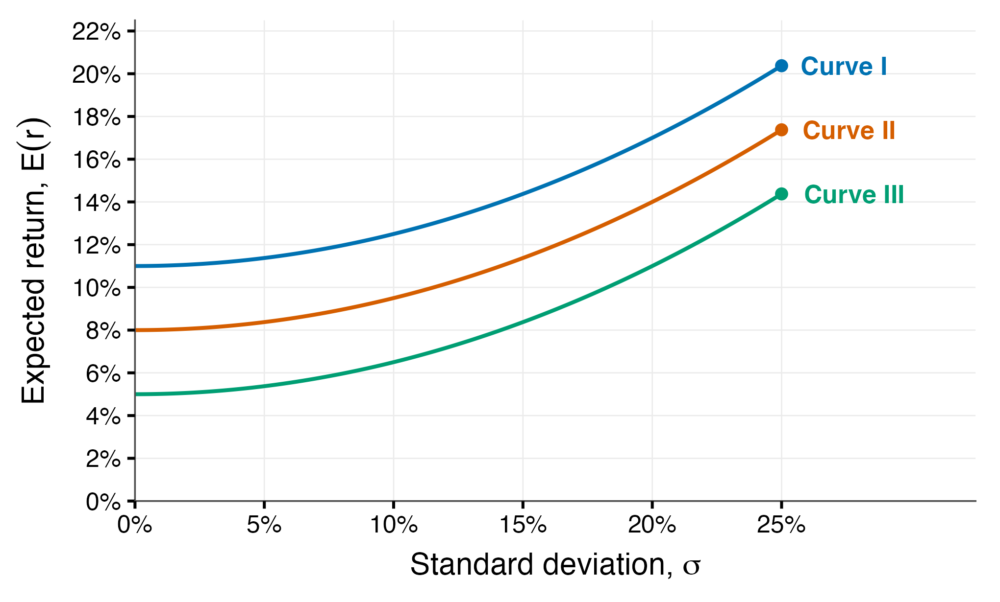
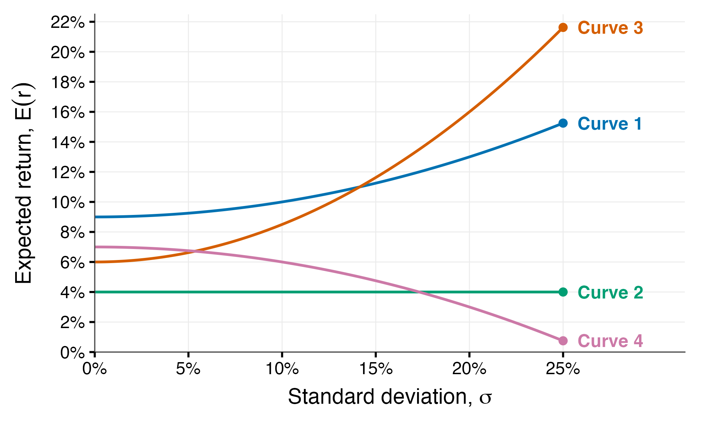



::: {=latex}
\vspace{-6em}
:::

## Part I: Multiple Choice

1. In scenario analysis, the expected return on asset $i$ is computed as:

   A)  The simple average of the returns across all scenarios
   B)  The return in the most likely scenario
   C)  The probability-weighted average of the returns across all scenarios
   D)  The highest return the asset can achieve

   ::: {.content-visible when-meta="params.solution"}
   ::: {.blue}
   **The correct answer is C.**

   $E(r_i) = \sum_{s=1}^{N} r_s \cdot p_s$ weights each scenario's return by its probability. A simple average (A) is only correct in the special case where every scenario is equally likely.
   :::
   :::

2. The holding period return (HPR) on a share is measured as:

   A)  The price change plus any income received, divided by the beginning price
   B)  The price change divided by the ending price
   C)  The income received divided by the beginning price
   D)  The price change divided by the beginning price, ignoring any income

   ::: {.content-visible when-meta="params.solution"}
   ::: {.blue}
   **The correct answer is A.**

   $HPR_1 = \dfrac{P_1 - P_0 + I_1}{P_0}$. The HPR captures **both** the capital gain and the income (dividend or interest), and is expressed relative to the price at the *start* of the period.
   :::
   :::

3. For a series of returns that varies from period to period, the geometric mean return is:

   A)  Always larger than the arithmetic mean return
   B)  Exactly equal to the arithmetic mean return
   C)  Larger or smaller depending on the sign of the returns
   D)  Always smaller than the arithmetic mean return

   ::: {.content-visible when-meta="params.solution"}
   ::: {.blue}
   **The correct answer is D.**

   The two are equal only when the return is constant in every period. Any variation in returns makes the geometric mean strictly smaller, because it accounts for compounding: a gain of 10% followed by a loss of 10% gives an arithmetic mean of 0% but a geometric mean of $-0.5\%$.
   :::
   :::

4. Diversification reduces portfolio risk most effectively when the assets held:

   A)  Have identical expected returns
   B)  Are less than perfectly positively correlated with each other
   C)  Are perfectly positively correlated with each other
   D)  All belong to the same industry

   ::: {.content-visible when-meta="params.solution"}
   ::: {.blue}
   **The correct answer is B.**

   Portfolio variance falls below the weighted average of the individual variances whenever $\rho_{1,2} < 1$. If the assets were perfectly positively correlated there would be no diversification benefit at all.
   :::
   :::

5. Which of the following risks CANNOT be eliminated through diversification?

   A)  The risk that a firm loses a major lawsuit
   B)  The risk that a firm's CEO dies unexpectedly
   C)  The risk that one industry suffers a downturn
   D)  The risk arising from the business cycle

   ::: {.content-visible when-meta="params.solution"}
   ::: {.blue}
   **The correct answer is D.**

   The business cycle is **market (systematic) risk**: it affects all firms in the market simultaneously, so holding more securities cannot diversify it away. Options A, B and C are all firm- or sector-specific (nonsystematic) risks.
   :::
   :::

6. A zero-variance portfolio can be constructed from two risky assets when the correlation between them is equal to:

   A)  $-1$
   B)  $0$
   C)  $+0.5$
   D)  $+1$

   ::: {.content-visible when-meta="params.solution"}
   ::: {.blue}
   **The correct answer is A.**

   Only perfect negative correlation allows the movements of the two assets to offset one another exactly. Any $\rho_{1,2} < 1$ delivers *some* risk reduction (a minimum-variance portfolio), but risk can be driven all the way to zero only when $\rho_{1,2} = -1$.
   :::
   :::

7. In the utility function $U = E(r) - \frac{1}{2} A \sigma^2$, an investor with $A = 0$ is:

   A)  Risk-averse, and requires a risk premium to hold a risky asset
   B)  Risk-loving, and gains utility from taking on risk
   C)  Risk-neutral, and ranks portfolios by expected return alone
   D)  Unable to rank portfolios at all

   ::: {.content-visible when-meta="params.solution"}
   ::: {.blue}
   **The correct answer is C.**

   With $A = 0$ the penalty term $\frac{1}{2}A\sigma^2$ vanishes, so $U = E(r)$ and variance is irrelevant to the ranking. $A > 0$ describes a risk-averse investor and $A < 0$ a risk-loving one.
   :::
   :::

8. An investor places a fraction $y$ of their capital in a risky portfolio P and the remainder in the risk-free asset. The standard deviation of the resulting complete portfolio is:

   A)  $\sigma_P$, regardless of the value of $y$
   B)  $y \cdot \sigma_P$
   C)  $y^2 \cdot \sigma_P$
   D)  $y \cdot \sigma_P + (1-y) \, r_f$

   ::: {.content-visible when-meta="params.solution"}
   ::: {.blue}
   **The correct answer is B.**

   The risk-free asset has zero variance and zero covariance with P, so only the risky fraction contributes to portfolio risk. Note it is the *variance* that scales with $y^2$ $\left(\sigma_C^2 = y^2 \sigma_P^2\right)$; taking the square root leaves the standard deviation proportional to $y$.
   :::
   :::

9. The slope of the Capital Allocation Line measures:

   A)  The additional expected return earned per unit of additional risk, i.e. the Sharpe ratio
   B)  The investor's degree of risk aversion
   C)  The variance of the risky portfolio
   D)  The proportion of wealth held in the risk-free asset

   ::: {.content-visible when-meta="params.solution"}
   ::: {.blue}
   **The correct answer is A.**

   The slope is $\dfrac{E(r_P) - r_f}{\sigma_P}$, the reward-to-variability (Sharpe) ratio. It is a property of the risky portfolio, not of the investor: two investors with very different risk aversion face the *same* CAL and simply choose different points along it.
   :::
   :::

10. Which statement about the minimum-variance frontier is correct?

    A)  Every portfolio lying on the frontier is efficient
    B)  The global minimum variance portfolio offers the highest expected return of all risky portfolios
    C)  Risk-averse investors prefer the portfolios lying below the global minimum variance portfolio
    D)  Only the portion of the frontier above the global minimum variance portfolio is the efficient frontier

    ::: {.content-visible when-meta="params.solution"}
    ::: {.blue}
    **The correct answer is D.**

    Portfolios below the GMVP are **dominated**: for the same level of risk, a portfolio on the upper branch offers a strictly higher expected return, so by the mean-variance criterion no rational investor would hold them.
    :::
    :::


```{r}
#| label: indifference-map
#| include: false
# Builds images/indifference_map_quiz.png, the figure used in Q11.
#
# Three curves E(r) = U + 0.5 * A * sigma^2 with the SAME A = 3 but different U:
# one investor's indifference map. Equal curvature means the curves are vertical
# shifts of one another and can never cross, so the highest curve is the highest
# utility at every level of risk. 

library(ggplot2)

A_common <- 3
map_curves <- data.frame(
    curve = factor(c("I", "II", "III"), levels = c("I", "II", "III")),
    U     = c(0.11, 0.08, 0.05)
)

sigma <- seq(0, 0.25, length.out = 400)
dat_map <- do.call(rbind, lapply(seq_len(nrow(map_curves)), function(i) {
    data.frame(curve = map_curves$curve[i],
               sigma = sigma,
               er    = map_curves$U[i] + 0.5 * A_common * sigma^2)
}))

lab_map <- data.frame(
    curve = map_curves$curve,
    sigma = 0.25,
    er    = map_curves$U + 0.5 * A_common * 0.25^2,
    text  = paste("Curve", map_curves$curve)
)

pal_map <- c("I" = "#0072B2", "II" = "#D55E00", "III" = "#009E73")

p_map <- ggplot(dat_map, aes(sigma, er, colour = curve)) +
    geom_line(linewidth = 0.9) +
    geom_point(data = lab_map, size = 2.1, show.legend = FALSE) +
    geom_text(data = lab_map, aes(label = text), hjust = -0.22, size = 4.4,
              fontface = "bold", show.legend = FALSE) +
    scale_colour_manual(values = pal_map) +
    scale_x_continuous(labels = function(x) paste0(x * 100, "%"),
                       breaks = seq(0, 0.25, 0.05),
                       limits = c(0, 0.325), expand = c(0, 0)) +
    scale_y_continuous(labels = function(x) paste0(x * 100, "%"),
                       breaks = seq(0, 0.22, 0.02),
                       limits = c(0, 0.225), expand = c(0, 0)) +
    labs(x = expression(paste("Standard deviation, ", sigma)),
         y = expression(paste("Expected return, ", E(r)))) +
    theme_classic(base_size = 15) +
    theme(
        legend.position = "none",
        axis.title.x = element_text(margin = margin(t = 7)),
        axis.title.y = element_text(margin = margin(r = 7)),
        panel.grid.major = element_line(colour = "grey92", linewidth = 0.3),
        axis.line = element_line(colour = "grey30", linewidth = 0.4),
        plot.margin = margin(10, 12, 8, 8)
    )

dir.create("images", showWarnings = FALSE)
ggsave("images/indifference_map_quiz.png", p_map,
       width = 6.8, height = 4.1, dpi = 300, bg = "white")
```


```{r #fig-same-A, fig.cap="Indifference curves – same curvature.", out.width="80%"}

```

11. @fig-same-A shows three indifference curves. Which curve gives the investor the **highest utility**?

    A)  Curve I
    B)  Curve II
    C)  Curve III
    D)  They all give the same utility, since the risk aversion coefficient is the same

    ::: {.content-visible when-meta="params.solution"}
    ::: {.blue}
    **The correct answer is A.**

    Because the risk aversion $A$ is the same for all three, the curves have identical curvature: they are simply vertical shifts of one another and can therefore **never cross**.

    The utility score is the **vertical intercept**, since setting $\sigma = 0$ in $E(r) = U + \frac{1}{2} A \sigma^2$ leaves $E(r) = U$. Reading the intercepts: Curve I gives $U = 11\%$, Curve II gives $8\%$ and Curve III gives $5\%$. Curve I is the highest.
    :::
    :::

```{r}
#| label: indifference-curves
#| include: false
# Builds images/indifference_curves_quiz.png, the figure used in Q11-Q13.
#
# Each curve is E(r) = U + 0.5 * A * sigma^2, the locus of (sigma, E(r)) pairs
# giving one investor the same utility score U:
#   curvature <-> risk aversion A  (convex A > 0, flat A = 0, concave A < 0)
#   intercept <-> utility score U  (value of E(r) at sigma = 0)
#
# The parameters are chosen so the two readings give different rankings:
# curve 3 is the most convex (largest A) but curve 1 has the highest intercept
# (largest U), and the two cross at sigma = 14.1%.
library(ggplot2)

curves <- data.frame(
    curve = factor(1:4),
    A     = c(2, 0, 5, -2),
    U     = c(0.09, 0.04, 0.06, 0.07)
)

sigma <- seq(0, 0.25, length.out = 400)
dat <- do.call(rbind, lapply(seq_len(nrow(curves)), function(i) {
    data.frame(curve = curves$curve[i],
               sigma = sigma,
               er    = curves$U[i] + 0.5 * curves$A[i] * sigma^2)
}))

# label placed at the right end of each curve
lab <- do.call(rbind, lapply(seq_len(nrow(curves)), function(i) {
    data.frame(curve = curves$curve[i],
               sigma = 0.25,
               er    = curves$U[i] + 0.5 * curves$A[i] * 0.25^2,
               text  = paste("Curve", curves$curve[i]))
}))

pal <- c("1" = "#0072B2", "2" = "#009E73", "3" = "#D55E00", "4" = "#CC79A7")

p <- ggplot(dat, aes(sigma, er, colour = curve)) +
    geom_line(linewidth = 0.9) +
    geom_point(data = lab, size = 2.1, show.legend = FALSE) +
    geom_text(data = lab, aes(label = text), hjust = -0.22, size = 4.4,
              fontface = "bold", show.legend = FALSE) +
    scale_colour_manual(values = pal) +
    scale_x_continuous(labels = function(x) paste0(x * 100, "%"),
                       breaks = seq(0, 0.25, 0.05),
                       limits = c(0, 0.315), expand = c(0, 0)) +
    scale_y_continuous(labels = function(x) paste0(x * 100, "%"),
                       breaks = seq(0, 0.22, 0.02),
                       limits = c(0, 0.225), expand = c(0, 0)) +
    labs(x = expression(paste("Standard deviation, ", sigma)),
         y = expression(paste("Expected return, ", E(r)))) +
    theme_classic(base_size = 15) +
    theme(
        legend.position = "none",
        axis.title.x = element_text(margin = margin(t = 7)),
        axis.title.y = element_text(margin = margin(r = 7)),
        panel.grid.major = element_line(colour = "grey92", linewidth = 0.3),
        axis.line = element_line(colour = "grey30", linewidth = 0.4),
        plot.margin = margin(10, 12, 8, 8)
    )

dir.create("images", showWarnings = FALSE)
ggsave("images/indifference_curves_quiz.png", p,
       width = 6.8, height = 4.1, dpi = 300, bg = "white")
```

--------------------------------------------------------------------------------

*Questions 12–14 refer to @fig-indifference-curves below.*

```{r #fig-indifference-curves}
#| fig.cap: "Indifference curves for four investors with different risk aversion and utility scores."
#| out.width: "80%"

```

12. Which curve belongs to the **most risk-averse** investor, i.e. the investor with the largest risk aversion coefficient $A$?

    A)  Curve 1
    B)  Curve 2
    C)  Curve 3
    D)  Curve 4

    ::: {.content-visible when-meta="params.solution"}
    ::: {.blue}
    **The correct answer is C.**

    Risk aversion shows up as **curvature**. Rearranging the utility function gives $E(r) = U + \frac{1}{2} A \sigma^2$, so $A$ is twice the coefficient on $\sigma^2$: the larger $A$ is, the more sharply the curve bends upward, because the investor demands a much bigger increase in expected return to accept each extra unit of risk.
    :::
    :::

13. Which curve represents the **highest utility score** $U$?

    A)  Curve 1
    B)  Curve 2
    C)  Curve 3
    D)  Curve 4

    ::: {.content-visible when-meta="params.solution"}
    ::: {.blue}
    **The correct answer is A.**

    The utility score is captured by the **intercept**. 
    Curve 1 has the highest intercept, hence curve 1 has the highest utility level.
    :::
    :::

14. Which curve belongs to a **risk-neutral** investor?

    A)  Curve 1
    B)  Curve 2
    C)  Curve 3
    D)  Curve 4

    ::: {.content-visible when-meta="params.solution"}
    ::: {.blue}
    **The correct answer is B.**

    A risk-neutral investor has $A = 0$, so the penalty term $\frac{1}{2} A \sigma^2$ disappears and $U = E(r)$. Utility no longer depends on $\sigma$, which makes the indifference curve **horizontal**: this investor is equally happy with a certain $4\%$ and with a wildly volatile portfolio expected to return $4\%$.
    :::
    :::


## Part II: Calculation Questions

15. **Scenario analysis and portfolio choice.**

    You are evaluating two funds. Their returns depend on the state of the economy next year as follows:

    | State of the Economy | Probability | Fund A | Fund B |
    | -------------------- | ----------- | ------ | ------ |
    | Recession            | 0.25        | $-12\%$ | $-4\%$ |
    | Normal growth        | 0.50        | $10\%$  | $8\%$  |
    | Boom                 | 0.25        | $28\%$  | $16\%$ |

    a)  Compute the expected return of each fund.
    b)  Compute the variance and standard deviation of each fund.
    c)  An investor has a risk aversion coefficient of $A = 4$. Using the utility score $U = E(r) - \frac{1}{2} A \sigma^2$, determine which fund the investor prefers.
    d)  Which fund would a **risk-neutral** investor choose? Explain why the answer differs from part (c).

    ::: {.content-visible when-meta="params.solution"}
    ::: {.blue}
    **Solution:**

    **(a) Expected returns.** Apply $E(r) = \sum_s r_s \, p_s$:
    $$E(r_A) = 0.25(-0.12) + 0.50(0.10) + 0.25(0.28) = -0.03 + 0.05 + 0.07 = 9\%$$
    $$E(r_B) = 0.25(-0.04) + 0.50(0.08) + 0.25(0.16) = -0.01 + 0.04 + 0.04 = 7\%$$

    **(b) Variance and standard deviation.** Apply $\sigma^2 = \sum_s \left[r_s - E(r)\right]^2 p_s$:
    $$\begin{aligned}
    \sigma_A^2 &= 0.25(-0.21)^2 + 0.50(0.01)^2 + 0.25(0.19)^2 \\
    &= 0.011025 + 0.00005 + 0.009025 \\
    &= 0.0201
    \end{aligned}$$
    $$\sigma_A = \sqrt{0.0201} = 0.1418 = 14.18\%$$
    $$\begin{aligned}
    \sigma_B^2 &= 0.25(-0.11)^2 + 0.50(0.01)^2 + 0.25(0.09)^2 \\
    &= 0.003025 + 0.00005 + 0.002025 \\
    &= 0.0051
    \end{aligned}$$
    $$\sigma_B = \sqrt{0.0051} = 0.0714 = 7.14\%$$

    Fund A offers the higher expected return, but with roughly twice the standard deviation.

    **(c) Utility scores with $A = 4$.**
    $$U_A = 0.09 - \tfrac{1}{2}(4)(0.0201) = 0.09 - 0.0402 = 0.0498$$
    $$U_B = 0.07 - \tfrac{1}{2}(4)(0.0051) = 0.07 - 0.0102 = 0.0598$$

    Since $U_B > U_A$, the investor prefers **Fund B**. Although Fund A earns 2 percentage points more in expectation, its much larger variance is penalised heavily by a risk aversion of $A = 4$.

    **(d) Risk-neutral investor.** With $A = 0$ the utility score collapses to $U = E(r)$, so the investor ignores variance entirely and chooses **Fund A** ($9\% > 7\%$).

    The answers differ because the two investors trade off risk and return differently: the risk-averse investor sacrifices expected return to avoid variance, whereas the risk-neutral investor is indifferent to risk and simply maximises expected return.
    :::
    :::

16. **The complete portfolio and the Capital Allocation Line.**

    You manage a risky portfolio P with an expected return of $14\%$ and a standard deviation of $20\%$. The risk-free rate is $5\%$.

    a)  A client invests $60\%$ of their wealth in your fund and the remaining $40\%$ in treasury bills. Compute the expected return and standard deviation of the client's complete portfolio.
    b)  Compute the slope of the Capital Allocation Line and state what it measures.
    c)  A second client has a risk aversion coefficient of $A = 3$. Compute the optimal weight $y^*$ in the risky portfolio, and the expected return and standard deviation of their optimal complete portfolio.
    d)  A third client has $A = 6$. Without redoing the full calculation, state whether their $y^*$ is higher or lower than in part (c), and explain the intuition.

    ::: {.content-visible when-meta="params.solution"}
    ::: {.blue}
    **Solution:**

    **(a) Complete portfolio with $y = 0.6$.**
    $$E(r_C) = r_F + y\left[E(r_P) - r_F\right] = 0.05 + 0.60(0.14 - 0.05) = 10.4\%$$
    $$\sigma_C = y \cdot \sigma_P = 0.60 \times 0.20 = 0.12 = 12\%$$

    **(b) Slope of the CAL.**
    $$\frac{E(r_P) - r_F}{\sigma_P} = \frac{0.14 - 0.05}{0.20} = \frac{0.09}{0.20} = 0.45$$

    This is the **Sharpe ratio** of the risky portfolio: the client earns 0.45 percentage points of extra expected return for every additional percentage point of standard deviation taken on.

    **(c) Optimal weight for $A = 3$.**
    $$y^* = \frac{E(r_P) - r_F}{A \, \sigma_P^2} = \frac{0.09}{3 \times 0.20^2} = \frac{0.09}{0.12} = 0.75$$

    So 75% in the risky portfolio and 25% in treasury bills:
    $$E(r_C) = 0.05 + 0.75(0.09) = 0.1175 = 11.75\%$$
    $$\sigma_C = 0.75 \times 0.20 = 0.15 = 15\%$$

    **(d) Optimal weight for $A = 6$.** Risk aversion enters the denominator of $y^*$, so doubling $A$ from 3 to 6 **halves** the optimal weight to $y^* = 0.375$.

    Intuitively, a more risk-averse investor penalises variance more heavily, so they require a larger risk premium to justify each unit of risk. Facing the same CAL, they therefore hold less of the risky portfolio and more of the risk-free asset.
    :::
    :::
