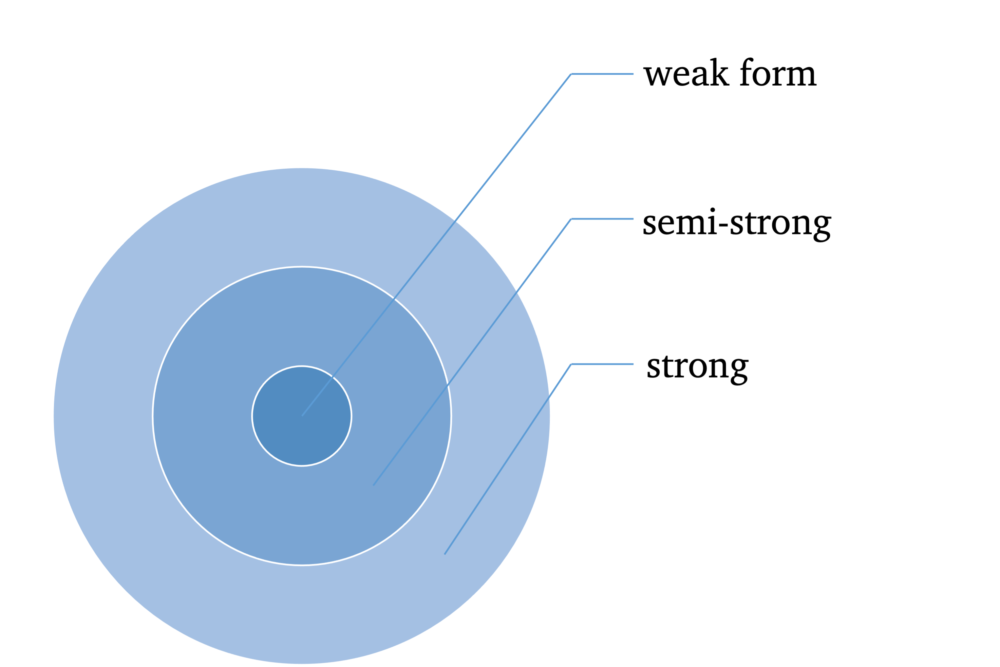

```{r setup, include=F, echo=F}
library(knitr) # load packages
library(kableExtra)
library(tidyverse)
library(bookdown)
# don't show code unless we explicitly set echo = TRUE
opts_chunk$set(echo = TRUE, message=FALSE, fig.align="center", fig.pos = "H")
opts <- options(knitr.kable.NA = "")

## control long outputs by using eg `max.lines = 10`
hook_output_default <- knitr::knit_hooks$get('output')
truncate_to_lines <- function(x, n) {
   if (!is.null(n)) {
      x = unlist(stringr::str_split(x, '\n'))
      if (length(x) > n) {
         # truncate the output
         x = c(head(x, n), '...\n')
      }
      x = paste(x, collapse = '\n') # paste first n lines together
   }
   x
}
knitr::knit_hooks$set(output = function(x, options) {
   max.lines <- options$max.lines
   x <- truncate_to_lines(x, max.lines)
   hook_output_default(x, options)
})
```


## EMH

A market in which prices always "fully reflect" available information is called "*efficient*."

Formally, the market is said to be efficient with respect to some *information set*.

Three forms of efficiency corresponding to differing information sets:

1.  weak-from (historical market trading data, such as prices, volumes)
2.  semistrong-form (fundamental data, such as earnings, dividends, accounting practices)
3.  strong-form (insider info, such as mergers and acquisitions)

Efficiency with respect to an information set implies that it is impossible to make economic profits by trading on the basis of [that information set].

-   Here by economic profits, we mean "abnormal/superior" returns after adjustment for risk and costs.

-   We need equilibrium (asset pricing) models for risk adjustments, such as CAPM, to determine the "normal" returns appropriate for bearing the level risk in a security.

-   If the abnormal return is unforecastable, and in this sense "random", then the *Efficiency Market Hypothesis* (EMH) is not rejected.

Market efficiency can be tested by revealing information to market participants and measuring the reaction of security prices. If prices do not move when info is revealed, then the market is efficient w.r.t. that info.

Challenges of testing EMH: Any test of efficiency must assume an equilibrium model that defines normal security returns. This leads to our null is a *joint test* of market efficiency and a correct equilibrium model.

The result of this is that when we reject the null, this could be because the market is truly inefficient or because an incorrect equilibrium model has been assumed.

-   With the wrong asset pricing model, we can wind up rejecting efficiency. It would be easy to find abnormal returns to be forecastable if we had the wrong equilibrium.

-   Asset pricing models give the equilibrium return; abnormal returns are deviations of real prices from equilibriums.

Types of market efficiency $\rightarrow$ Violations of efficiency:

-   weak form $\rightarrow$ technical analysis or charting earn superior profits (after adjustment for risk).
-   semistrong form $\rightarrow$ fundamental analysis achieves superior returns
-   strong from $\rightarrow$ corporate insiders making profitable trades

```{r emh, out.width="50%", fig.cap="EMH", echo=FALSE}
# All defaults

```

Perfect efficiency exists only in the idealized frictionless world of the imagination. Abnormal returns will exist if there are costs of gathering and processing information. Since market efficiency is an idealization that is economically unrealizable, what we can do is to measure relative efficiency. And if some markets turn out to be particularly inefficient, then investors will be well-prepared to take advantage of the opportunity to make profits.

Most tests suggest that if the security (demeaned) return cannot be forecasted, then market efficiency cannot be rejected.

------------------------------------------------------------------------

## Predictability of Asset Returns

A process $\{p_t\}$ is called a *Random Walk* (RW) if:

$$
p_t = \mu + p_{t-1} + e_t 
$$

where $E(e_t)=0$ and $\text{Var}(e_t)=\sigma^2$.

-   $\mu$ is called the expected price change or *drift*.

-   $\{e_t\}$ is called the innovations, disturbances, or increments. There are differing hypothesis regarding to its distribution:

    -   RW1: $e_t\sim \text{IID } (0, \sigma^2)$ meaning increments are Independently and Identically Distributed (IID).

    -   RW2: $e_t\sim \text{INID } (0, \sigma^2)$ independent but not (necessarily) identically distributed (INID) increments. RW2 is weaker than RW1 because it relaxes the assumption of identically distributed increments.

        -   RW2 allows for heteroskedasticity.

    -   RW3: $e_t$ is uncorrelated. $\text{Cov}[e_t, e_{t-k}]=0$ for all $k\neq 0$. This is the weakest form of RW.

        -   RW3 allows for dependence in higher moments.

        -   An example that satisfiies RW3 but not RW1 and RW2: $\text{Cov}[e_t,e_{t−k}]=0$ for all $k\neq 0$, but $\text{Cov}[e_t^2,e_{t−k}^2]\neq0$ for some $k\neq 0$. In words, first moments are uncorrelated, but second moments are correlated; therefore, such a process is not independent.

-   Let $p_t=\ln P_t$ be the natural logarithm of price $P_t$, and $r_t=\mu+e_t=\Delta p = p_t-p_{t-1}$. Then $r_t$ is the **log return** at time $t$.

------------------------------------------------------------------------

### Cowles and Jones Test

@Cowles1937 proposed a test of RW1 using the frequency of *sequences* and *reversals* in historical stock returns.

-   Sequences: pairs of consecutive returns with the same sign ($(+,+)$ or $(-,-)$);

-   Reversals: consecutive returns with opposite signs ($(+,-)$ or $(-,+)$).

More formally, we define $I_t$ an indicator variable as:

$$
\begin{align*}
I_t = 
\begin{cases}
1 & \text{if } r_t>0 \\
0 & \text{if } r_t\leq0
\end{cases}
\end{align*}
$$

$I_t$ is an analogy to the *Bernoulli* coin-tossing experiments. That is, when it is a fair coin, $X_t\sim \text{Bernoulli}(p=1/2)$

$$
\begin{align*}
X_t = 
\begin{cases}
1 & \text{if it is a head, with prob. } p=\frac{1}{2}  \\
0 & \text{if it is a tail, with prob. } 1-p=\frac{1}{2}.
\end{cases}
\end{align*}
$$

The number of sequences ($N_s$) and reversals ($N_r$) can be expressed as functions of $I_t$'s.

$$
\begin{aligned}
N_s &\equiv \sum_{t=1}^n Y_t, \quad \color{#32CD32}{Y_t} \equiv I_tI_{t-1} + (1-I_t)(1-I_{t-1})  \\
N_r &\equiv n-N_s. 
\end{aligned}
$$

### RW without drift

For simplicity, we assume $\mu=0$ (a driftless RW) for now. $r_t=e_t$.

If $p_t$ follows a driftless RW, then for any pair of consecutive returns, a sequence and a reversal are equally probable. We would expect $N_s$ should be approximately equal to $N_r$.

- $N_s + N_r = n$ 

The Cowles-Jones test statistic is given by the ratio of the probability of a sequence $\pi_s$ to the probability of a reversal $1-\pi_s$.

$$
\begin{equation} (\#eq:CJ) 
\widehat{\text{CJ}} \equiv \frac{N_s}{N_r} = \frac{N_s/n}{N_r/n} = \frac{\hat{\pi}_s}{1-\hat{\pi}_s} \xrightarrow{p} \frac{\pi_s}{1-\pi_s} = \text{CJ} = \frac{1/2}{1-1/2} = 1 
\end{equation}
$$


```{exercise, proof1}
Show $\pi_s=\frac{1}{2}$.

Hint: This is equivalent to show that 
$$
Y_t = 
\begin{cases}
1 & \text{with prob. } p= \pi_s \\
0 & \text{with prob. } 1-p= 1-\pi_s .
\end{cases}
$$

```

------------------------------------------------------------------------

### RW with drift

$r_t=\mu+e_t$. Such a drift, either positive or negative, makes sequences more likely than reversals.

For now we assume that log prices follow a normal random walk with drift:

$$
p_t=\mu+p_{t-1}+e_t, \quad e_t\sim N(0, \sigma^2).
$$
Then $I_t$ is no longer a fair coin-toss but is biased in the direction of th drift, i.e.,

$$
I_t = 
\begin{cases}
1 & \text{with prob. } p= \pi \\
0 & \text{with prob. } 1-p= 1-\pi .
\end{cases}
$$
where 

$$
\pi \equiv P(r_t>0) = \Phi \left(\frac{\mu}{\sigma}\right).
$$
$\Phi(.)$ is the cdf of the *standard normal* distribution.

Given that $\Phi(.)$ is symmetric, 

- if the drift $\mu$ is positive, then $\pi>\frac{1}{2}$; 
- if the drift $\mu$ is negative, then $\pi<\frac{1}{2}$.


```{exercise, proof2}
Show $\pi=\Phi \left(\frac{\mu}{\sigma}\right)$.
```

$$
\begin{aligned}
P(r_t>0) &= P(\mu+e_t>0) \\
&= P(e_t>-\mu) \\
&= P\left( \frac{e_t}{\sigma} > -\frac{\mu}{\sigma}\right) \quad e_t\sim N(0, \sigma^2), \text{ then } \frac{e_t}{\sigma}\sim N(0,1) \\
&= P \left( \frac{e_t}{\sigma} < \frac{\mu}{\sigma} \right) \\
&= \Phi \left(\frac{\mu}{\sigma} \right)
\end{aligned}
$$


Then we have 

$$
\text{CJ} = \frac{\pi_s}{1-\pi_s} = \frac{\pi^2+(1-\pi)^2}{2\pi(1-\pi)}
$$

```{exercise, proof3}
Show $\pi_s=\pi^2+(1-\pi)^2$.

Hint: use the probability mass function of $Y_t$ in Proof. \@ref(exr:proof1).
```


The asymptotic distribution of $\widehat{\text{CJ}}$ is given by

$$
\widehat{\text{CJ}} \overset{a}{\sim} N \left(\frac{\pi_s}{1-\pi_s}, \frac{\pi_s(1-\pi_s) + 2\big[\pi^3+(1-\pi)^3-\pi_s^3\big]}{n-(1-\pi_s)^4} \right)
$$
Refer to @Campbell1996 chapter 2 for proof.


------------------------------------------------------------------------

### Simulation example

```{r CJ-data}
# RW example
set.seed(123)
t <- seq(1, 100, by=1)
et <- rnorm(length(t), mean=0, sd=1) # IID N(0,1) increments
pt <- c(0, cumsum(et))  # driftless random walk
par(mfrow=c(2,1)); par(mar=c(3.5, 4, 2, .5), mgp=c(2.4,0.8,0))
plot(t, et, type="o", col="blue", xlab="t", ylab=expression(e[t]), cex.lab=1.2)
plot(c(0,t), pt, type="o", col="blue", xlab="t", ylab=expression(p[t]), cex.lab=1.2)

It <- ifelse(et>0,1,0)
It_1 <- c(NA, head(It, -1))
data <- cbind(et, It, It_1) %>% as_tibble()
data <- data %>% mutate(yt = It*It_1 + (1-It)*(1-It_1))
data
```

```{r CJ-test}
Ns <- sum(data$yt, na.rm=TRUE)
Nr <- length(t)-Ns
CJ_hat <- Ns/Nr
CJ_hat
pi_hat <- sum(It)/length(t)
pis_hat <- Ns/length(t)
sigma2 <- (pis_hat*(1-pis_hat) + 2*(pi_hat^3 + (1-pi_hat)^3 - pis_hat^2)) /(length(t))/(1-pis_hat)^4
sigma <- sqrt(sigma2)
t_stat <- (CJ_hat-1)/sigma
t_stat
p_value <- pnorm(-abs(t_stat)) *2
list(test_statistic = t_stat, p_value = p_value)
```

The estimate is not statistically significantly different from $1$. Therefore, we fail to reject the null hypothesis of random walk.


------------------------------------------------------------------------

### References
